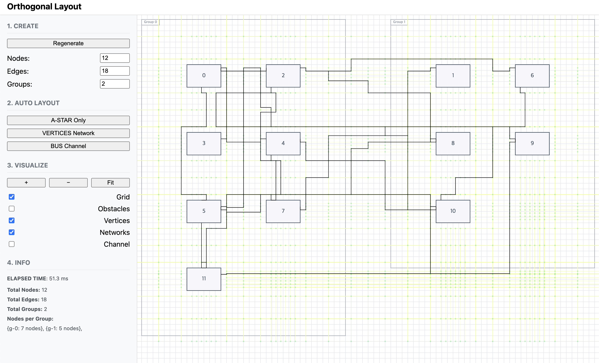
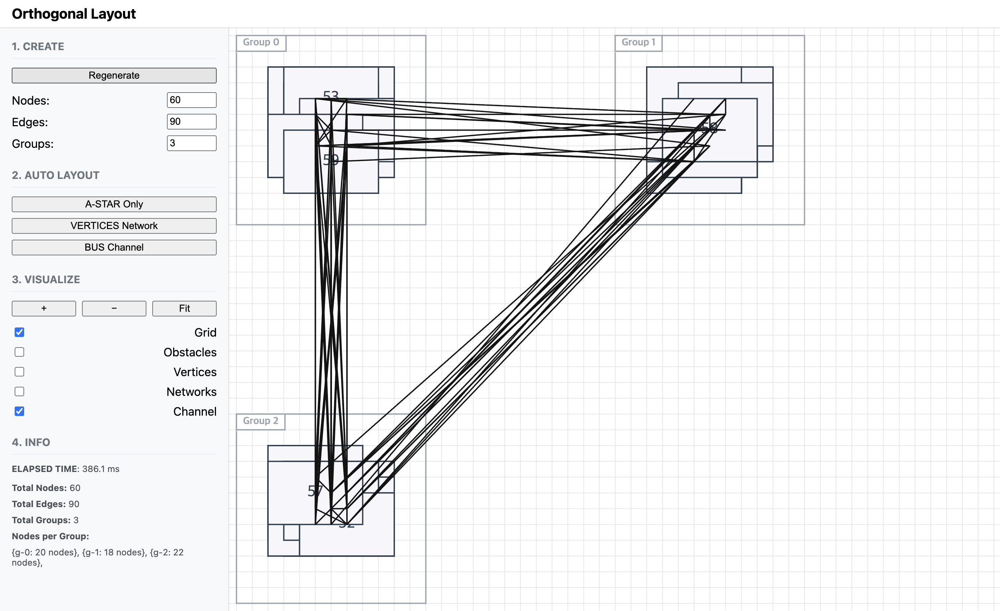

# Orthogonal Layout 자동 정렬 알고리즘

시스템 엔지니어링 다이어그램과 같이 복잡한 노드-엣지 그래프를 자동으로 정돈하는 **Orthogonal Layout 알고리즘** 구현 프로젝트입니다.

## 주요 기능

- **자동 배치:** 노드/그룹을 격자 기반으로 배치, 겹침 방지
- **직교 라우팅:** 모든 엣지를 수평/수직 선분으로만 연결
- **비용 최적화:** 굴곡·교차 최소화 (가중치 기반)
- **포트 제약:** 노드 면(상/하/좌/우)별 연결
- **시각화 옵션:** Grid, Obstacles, Vertices 등 알고리즘 내부 상태 확인 가능

---

## 아키텍처 개요

### 1. 디렉터리 구조

```plaintext
orthogonal-layout/
 ├─ src/
 │   ├─ app/             # 애플리케이션 초기화 및 설정 (진입점, 설정값 로딩 등)
 │   ├─ domain/          # 데이터 도메인 모델 (Node/Edge/Group 타입 정의, 시나리오 생성)
 │   ├─ layout/          # 자동 레이아웃 알고리즘 구현 모듈
 │   │    ├─ placement/    # 노드 및 그룹 배치 알고리즘 (초기 배치, 겹침 해소)
 │   │    ├─ port/         # 포트 할당 및 경로 다듬기 (포트 위치 선정, 경로 정리)
 │   │    ├─ routing/      # 엣지 라우팅 알고리즘 (여러 전략별 구현: A*, Bus, Vertices)
 │   │    ├─ compaction/   # 배치 완료 후 불필요한 여백 압축 로직
 │   │    └─ pipeline.ts   # Auto Layout 전체 파이프라인 실행 (RoutingStrategy 호출)
 │   ├─ utils/           # 공통 유틸리티 (수학 계산, 우선순위 큐 등 자료 구조)
 │   └─render/           # Canvas 렌더링 및 디버그 시각화 (격자, 장애물, 경계 등 그리기)
 └─ docs/
      ├─ adr/            # 설계 결정 기록 (ADR) 문서 모음
      └─ src/            # 문서용 이미지
```

### 2. Domain Model

<p align="center">
  
</p>

- 모든 데이터는 `Node`, `Edge`, `Group의` **Map 컬렉션**으로 구성된 중앙 `Graph` 객체를 통해 관리됩니다.
- 각 `Node`는 `Port`를 통해 연결점을 정의하고, `Edge`는 라우팅 결과인 `path`를 저장하여 이들 사이의 관계를 나타냅니다.

### 3. flowChart

<p align="center">
  
</p>

- **배치(Placement)** : 노드와 그룹의 위치를 결정합니다.
- **라우팅(Routing)** : 세 가지 전략 중 하나를 선택해 엣지 경로를 계산합니다.
- **후처리 및 렌더링(Post Process & Render)** : 최종 결과를 시각화합니다.

<br/>

상세 설계 및 알고리즘 발전 과정은 [ADR 문서](docs/adr)를 참고바랍니다.

<br/>
<br/>

---

## 실행 방법

```bash
# 저장소 클론
$ git clone https://github.com/parkhongseok/orthogonal-layout.git
$ cd orthogonal-layout

# 의존성 설치
$ npm install

# 개발 서버 실행
$ npm run dev
```

접속: [http://localhost:5173](http://localhost:5173)

---

## 사용 방법

1. **그래프 생성:** CREATE 패널에서 노드/엣지/그룹 개수 설정 후 **Regenerate**
2. **레이아웃 실행:** AUTO LAYOUT 패널에서 전략 선택 (A\*, Bus, Vertices)
3. **시각화 옵션:** VISUALIZE 패널에서 체크박스로 내부 구조 표시

> 마우스 휠로 확대 축소 및 드래그로 화면 이동 가능합니다.

---

## 기술 스택

| 구분      | 사용 기술                                 |
| --------- | ----------------------------------------- |
| 언어      | TypeScript                                |
| 빌드 도구 | Vite                                      |
| 시각화    | HTML5 Canvas                              |
| 알고리즘  | A\* Search, Bus Channel, Visibility Graph |

## 구현 화면

### 1. A\* 라우팅

<table align="center">
  <tr>
    <td align="center">
      
      <br>
      <sub>12노드 / 18엣지 / 2그룹 시나리오</sub>
    </td>
    <td align="center">
      
      <br>
      <sub>60노드 / 90엣지 / 3그룹 시나리오</sub>
    </td>
    <td align="center">
      
      <br>
      <sub>120노드 / 180엣지 / 4그룹 시나리오</sub>
    </td>
  </tr>
</table>

### 2. Bus Channel 라우팅

<table align="center">
  <tr>
    <td align="center">
      
      <br>
      <sub>12노드 / 18엣지 / 2그룹 시나리오</sub>
    </td>
    <td align="center">
      
      <br>
      <sub>60노드 / 90엣지 / 3그룹 시나리오</sub>
    </td>
    <td align="center">
      
      <br>
      <sub>120노드 / 180엣지 / 4그룹 시나리오</sub>
    </td>
  </tr>
</table>

### 3. 정점 네트워크 라우팅

<table align="center">
  <tr>
    <td align="center">
      
      <br>
      <sub>12노드 / 18엣지 / 2그룹 시나리오</sub>
    </td>
    <td align="center">
      
      <br>
      <sub>60노드 / 90엣지 / 3그룹 시나리오</sub>
    </td>
    <td align="center">
      
      <br>
      <sub>120노드 / 180엣지 / 4그룹 시나리오</sub>
    </td>
  </tr>
</table>

### 4. 초기 상태

<table align="center">
  <tr>
    <td align="center">
      
      <br>
      <sub>12노드 / 18엣지 / 2그룹 시나리오</sub>
    </td>
    <td align="center">
      
      <br>
      <sub>60노드 / 90엣지 / 3그룹 시나리오</sub>
    </td>
    <td align="center">
      
      <br>
      <sub>120노드 / 180엣지 / 4그룹 시나리오</sub>
    </td>
  </tr>
</table>

## TODO

- **Bus Channel**

  > **TODO**: 성능 개선  
  > **TODO**: 그룹 밖 채널 겹침 문제  
  > **TODO**: 채널 넓이 확보 및 우회 필요

- **Vertices Network**
  > **TODO**: 안전 지역 내 정점 생성 문제  
  > **TODO**: 단순 경로 최적화 필요
