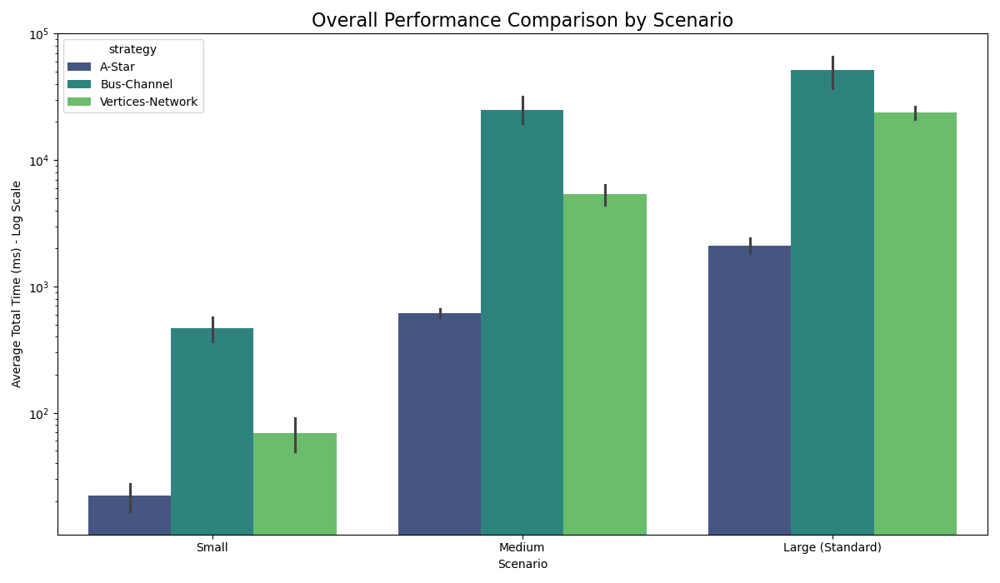
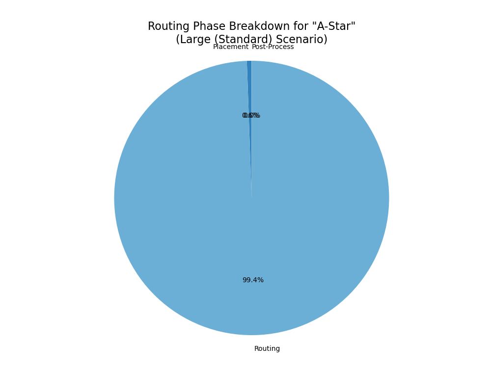
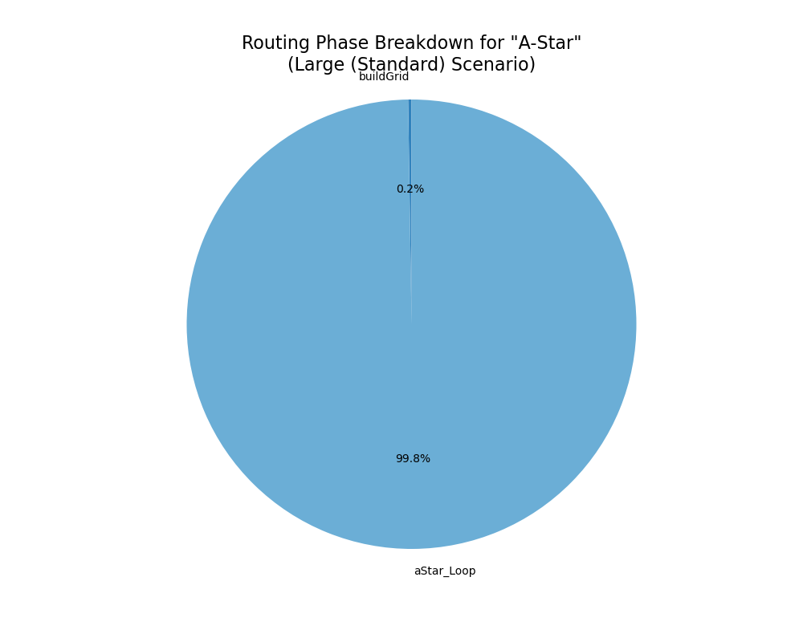
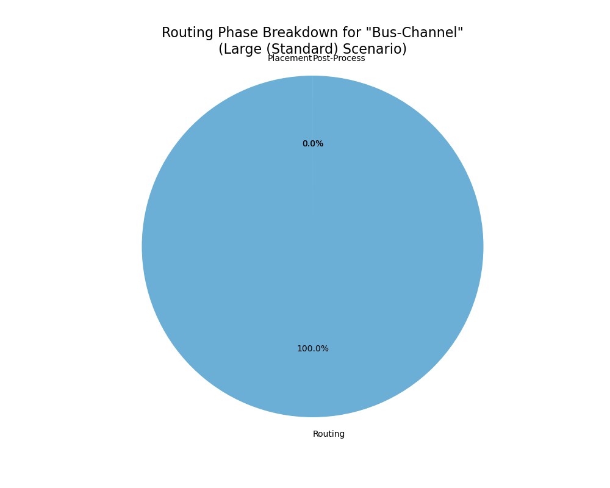
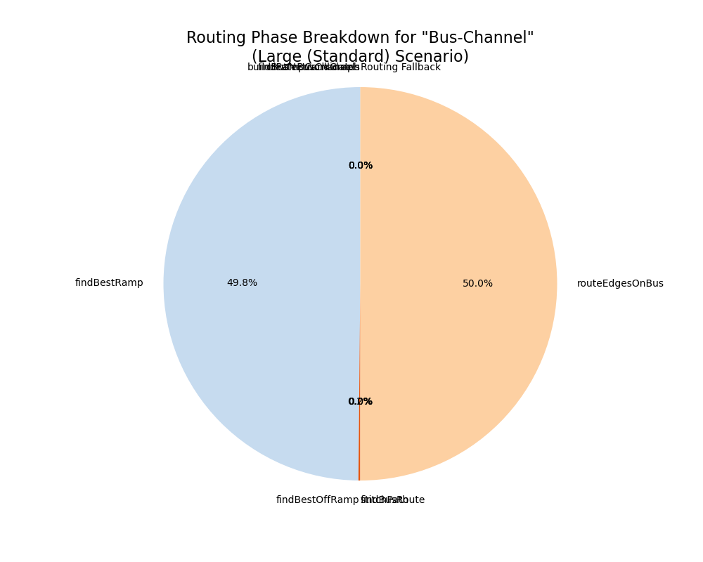
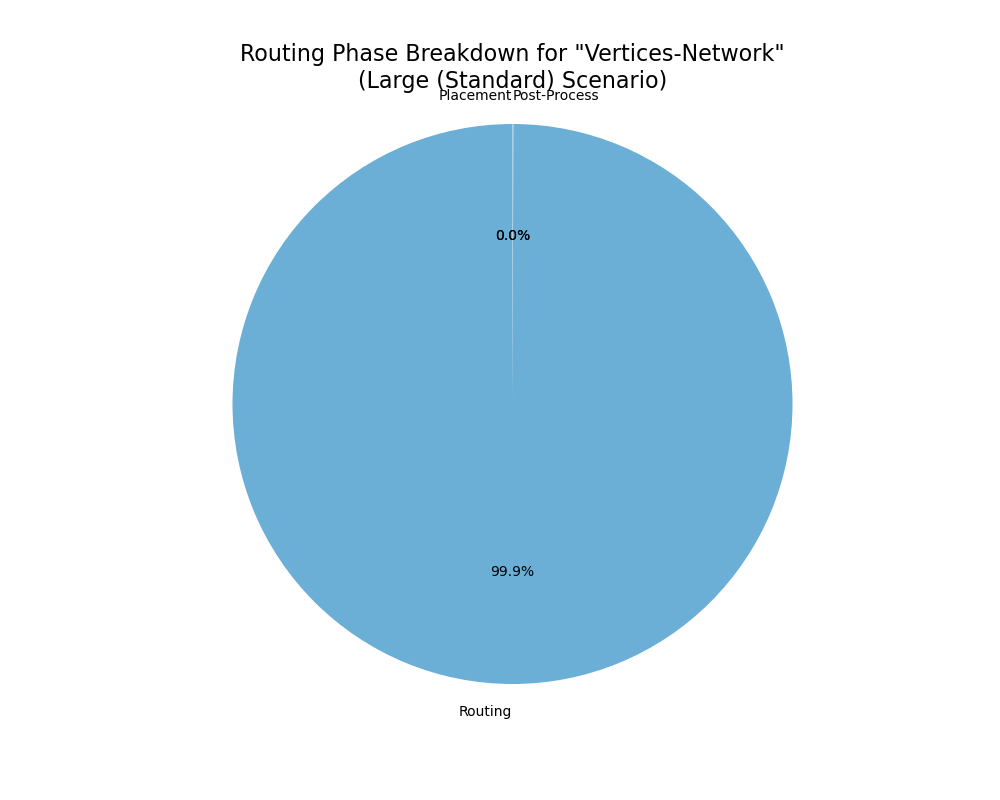
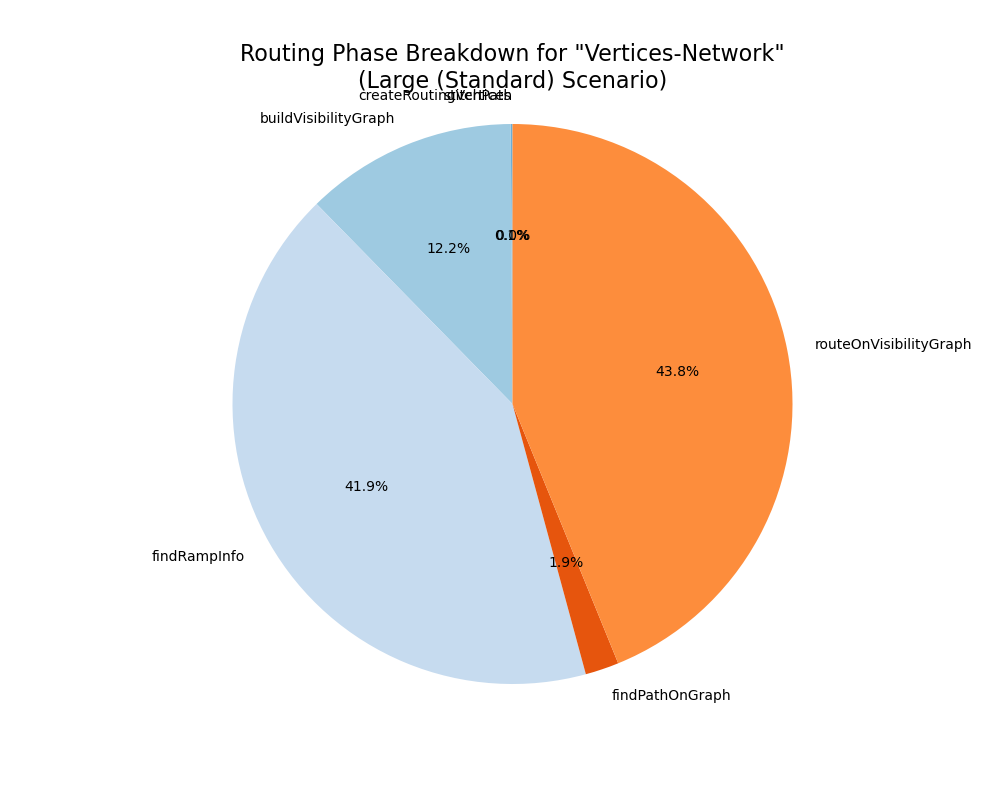

# Performance Benchmark Report

## 📈 Overall Performance Summary (totalTime in ms)

### Performance Visualization

|                                          |     mean |      std |      min |      max |
|:-----------------------------------------|---------:|---------:|---------:|---------:|
| ('Large (Standard)', 'A-Star')           |  2112.1  |   362.75 |  1763.34 |  2578.47 |
| ('Large (Standard)', 'Bus-Channel')      | 51731.5  | 19141.6  | 30398.3  | 73382    |
| ('Large (Standard)', 'Vertices-Network') | 23714.2  |  3585.63 | 19031.3  | 27758.6  |
| ('Medium', 'A-Star')                     |   615.92 |    56.87 |   540.45 |   686.67 |
| ('Medium', 'Bus-Channel')                | 25028.6  |  7982.03 | 18152.2  | 37352.2  |
| ('Medium', 'Vertices-Network')           |  5408.6  |  1274.95 |  3686.88 |  6477.15 |
| ('Small', 'A-Star')                      |    22.04 |     7.58 |    14.1  |    32.61 |
| ('Small', 'Bus-Channel')                 |   468.04 |   132.18 |   307.73 |   596.22 |
| ('Small', 'Vertices-Network')            |    69.05 |    25.03 |    37.4  |   107.13 |

 #### Analysis
[여기에 분석 내용을 직접 작성하세요]

 
 

## 🛠️ Performance for 'Large (Standard)' Scenario (average time in ms)

### Strategy: A-Star

#### three step result 

|              |   Average Time (ms) |
|:-------------|--------------------:|
| Placement    |               11.72 |
| Routing      |             2099.12 |
| Post-Process |                0.51 |

 

#### routing breakdown result

|            |   Average Time (ms) |
|:-----------|--------------------:|
| buildGrid  |                5.04 |
| aStar_Loop |             2093.82 |

 #### Analysis
[여기에 분석 내용을 직접 작성하세요]

 
 

### Strategy: Bus-Channel

#### three step result 

|              |   Average Time (ms) |
|:-------------|--------------------:|
| Placement    |                1.7  |
| Routing      |            51728.5  |
| Post-Process |                0.66 |

 

#### routing breakdown result

|                      |   Average Time (ms) |
|:---------------------|--------------------:|
| createBusChannels    |                5.92 |
| buildBusNetworkGraph |                0.04 |
| findRampCandidates   |                6.08 |
| findBestRamp         |            51555.8  |
| findBestOffRamp      |              157.5  |
| findBusRoute         |                0.43 |
| stitchPath           |                1.12 |
| routeEdgesOnBus      |            51722.2  |
| Routing Fallback     |                0.34 |

 #### Analysis
[여기에 분석 내용을 직접 작성하세요]

 
 

### Strategy: Vertices-Network

#### three step result 

|              |   Average Time (ms) |
|:-------------|--------------------:|
| Placement    |                1.51 |
| Routing      |            23701    |
| Post-Process |               11.09 |

 

#### routing breakdown result

|                        |   Average Time (ms) |
|:-----------------------|--------------------:|
| stitchPath             |                1.5  |
| createRoutingVertices  |               39.62 |
| buildVisibilityGraph   |             5163.53 |
| findRampInfo           |            17672.9  |
| findPathOnGraph        |              819.22 |
| routeOnVisibilityGraph |            18497.9  |

 #### Analysis
[여기에 분석 내용을 직접 작성하세요]

 
 

