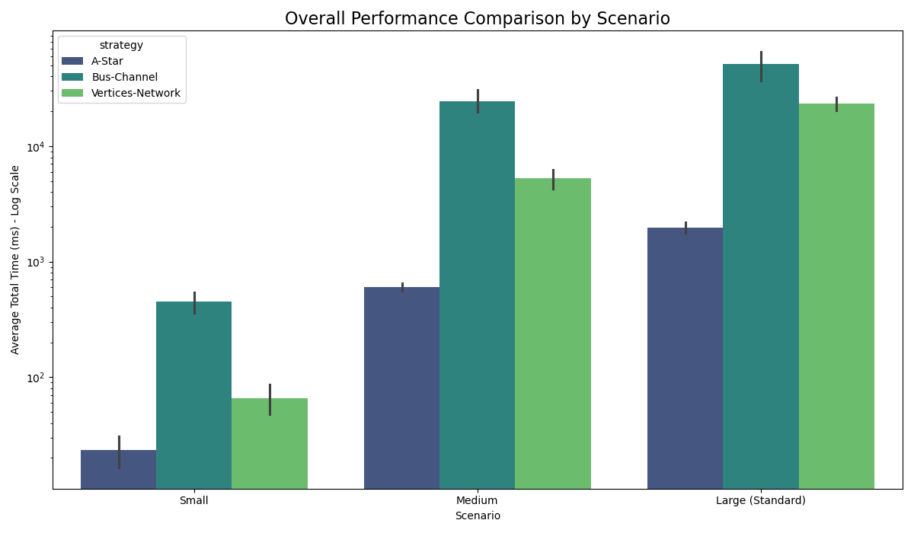
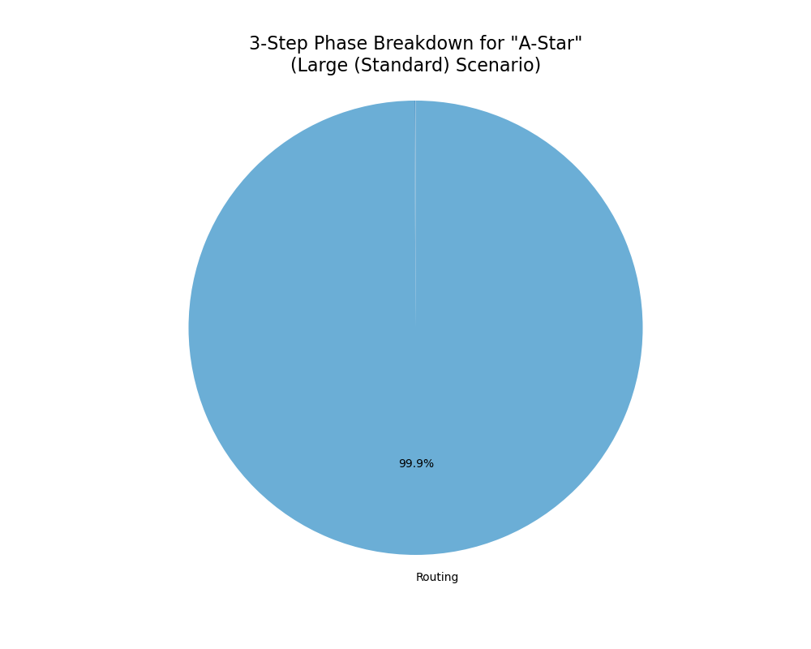
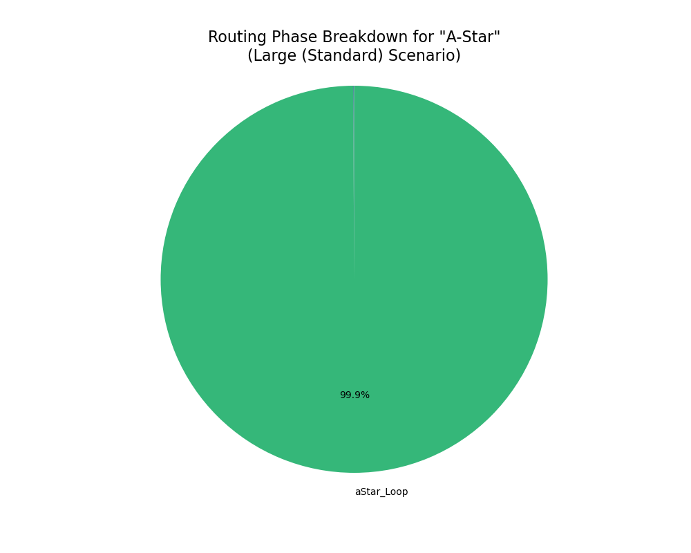
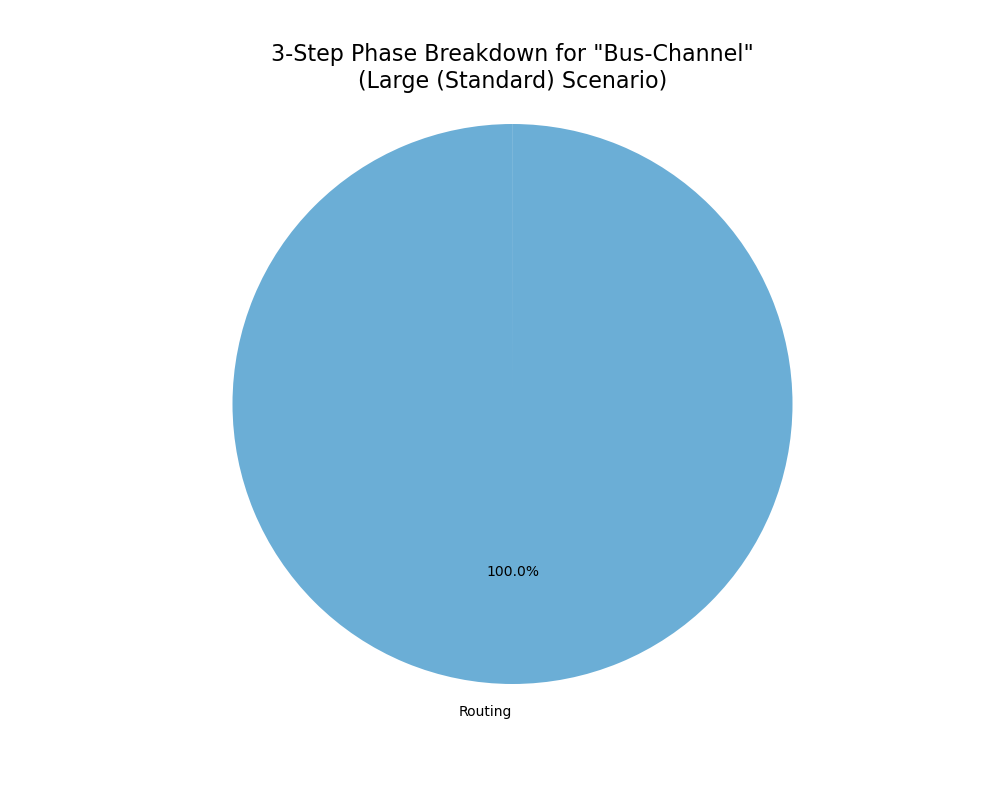
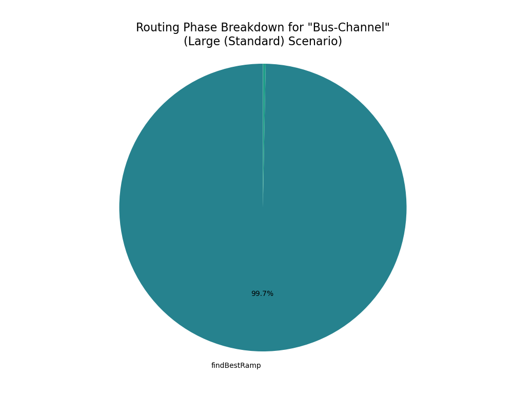
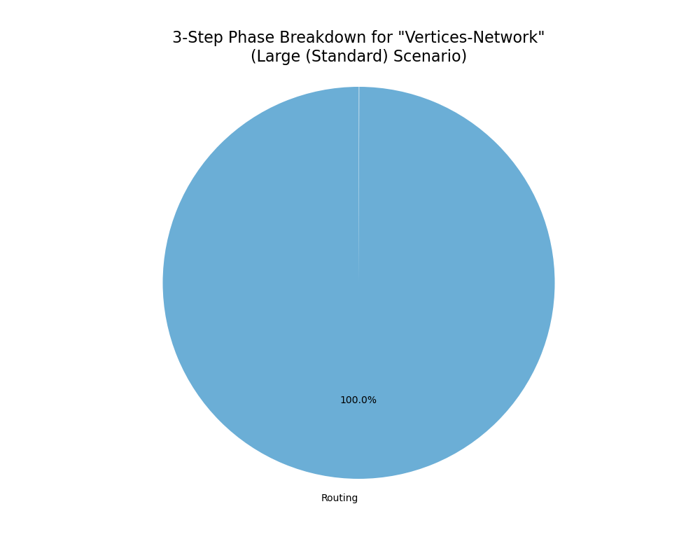
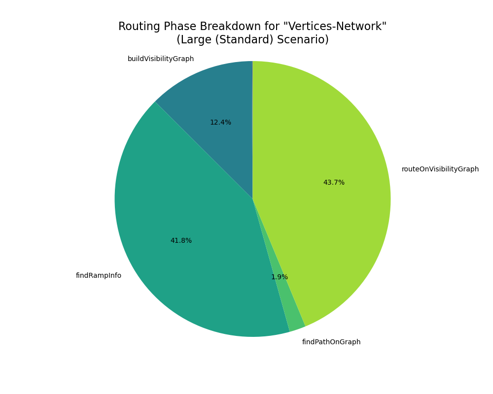

# Performance Benchmark Report

Date: 2025-10-09_22-29-55

## 📈 Overall Performance Summary

### Performance Visualization

|                                          |     mean |      std |      min |      max |
|:-----------------------------------------|---------:|---------:|---------:|---------:|
| ('Large (Standard)', 'A-Star')           |  1970.96 |   273.43 |  1710.36 |  2300.49 |
| ('Large (Standard)', 'Bus-Channel')      | 51232.7  | 19028.7  | 30272.6  | 71860.4  |
| ('Large (Standard)', 'Vertices-Network') | 23392.9  |  3687.75 | 18756.4  | 27717.9  |
| ('Medium', 'A-Star')                     |   607.18 |    61.45 |   514.11 |   679.56 |
| ('Medium', 'Bus-Channel')                | 24574.7  |  7042.04 | 18296.5  | 35659.1  |
| ('Medium', 'Vertices-Network')           |  5260.16 |  1273.25 |  3696.86 |  6503.2  |
| ('Small', 'A-Star')                      |    23.47 |     9.34 |    13.81 |    37.32 |
| ('Small', 'Bus-Channel')                 |   449.89 |   121.5  |   312.64 |   550.7  |
| ('Small', 'Vertices-Network')            |    66.2  |    23.59 |    35.52 |   101.86 |

 #### Analysis
[여기에 분석 내용을 직접 작성하세요]

 

 

## 🛠️ Performance for 'Large (Standard)' Scenario (average time in ms)

### Strategy: A-Star

#### three step result 

|              |   Average Time (ms) |
|:-------------|--------------------:|
| Placement    |                1.49 |
| Routing      |             1968.54 |
| Post-Process |                0.48 |

 

#### routing breakdown result

|            |   Average Time (ms) |
|:-----------|--------------------:|
| buildGrid  |                1.48 |
| aStar_Loop |             1966.67 |

 #### Analysis
[여기에 분석 내용을 직접 작성하세요]

 

 

### Strategy: Bus-Channel

#### three step result 

|              |   Average Time (ms) |
|:-------------|--------------------:|
| Placement    |                1.61 |
| Routing      |            51228.7  |
| Post-Process |                1.78 |

 

#### routing breakdown result

|                      |   Average Time (ms) |
|:---------------------|--------------------:|
| createBusChannels    |                2.97 |
| buildBusNetworkGraph |                0.04 |
| findRampCandidates   |                6.92 |
| findBestRamp         |            51057.9  |
| findBestOffRamp      |              157.3  |
| findBusRoute         |                0.45 |
| stitchPath           |                1.33 |
| Routing Fallback     |                0.25 |

 #### Analysis
[여기에 분석 내용을 직접 작성하세요]

 

 

### Strategy: Vertices-Network

#### three step result 

|              |   Average Time (ms) |
|:-------------|--------------------:|
| Placement    |                1.53 |
| Routing      |            23380.9  |
| Post-Process |                9.78 |

 

#### routing breakdown result

|                        |   Average Time (ms) |
|:-----------------------|--------------------:|
| stitchPath             |                1.45 |
| createRoutingVertices  |               36.98 |
| buildVisibilityGraph   |             5161.89 |
| findRampInfo           |            17382.9  |
| findPathOnGraph        |              793.67 |
| routeOnVisibilityGraph |            18182    |

 #### Analysis
[여기에 분석 내용을 직접 작성하세요]

 

 

