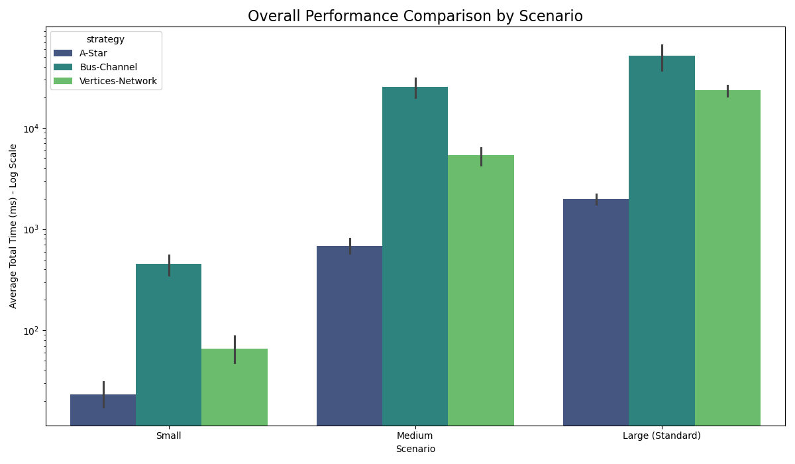
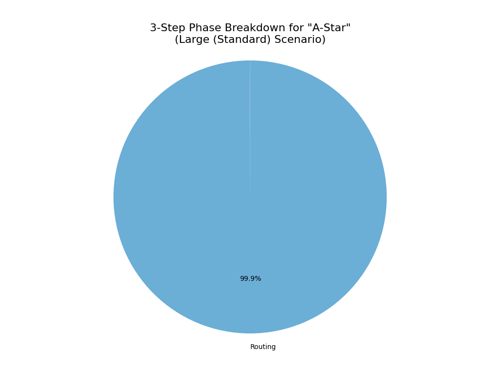
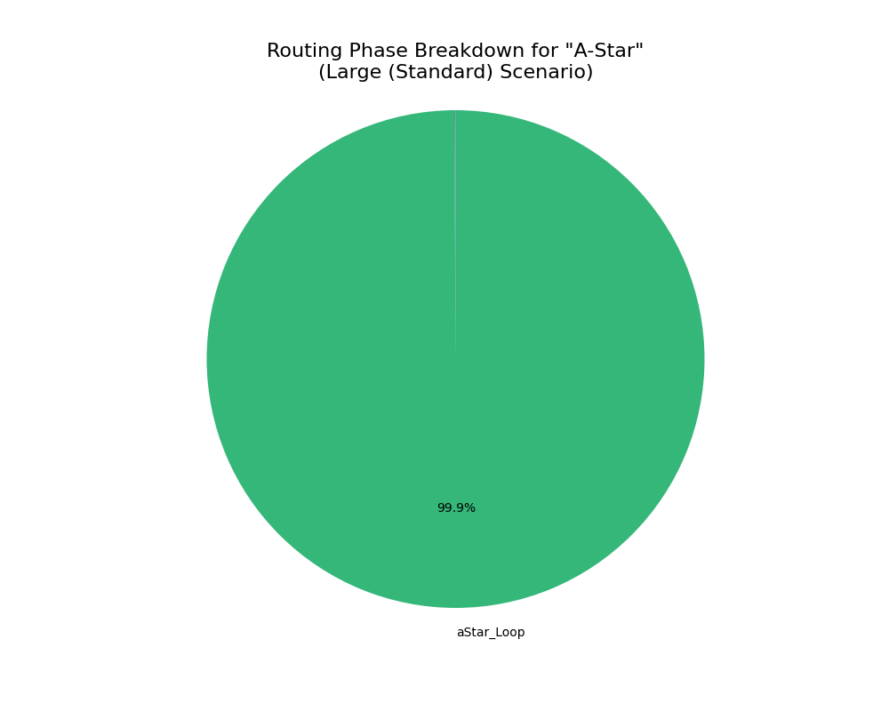
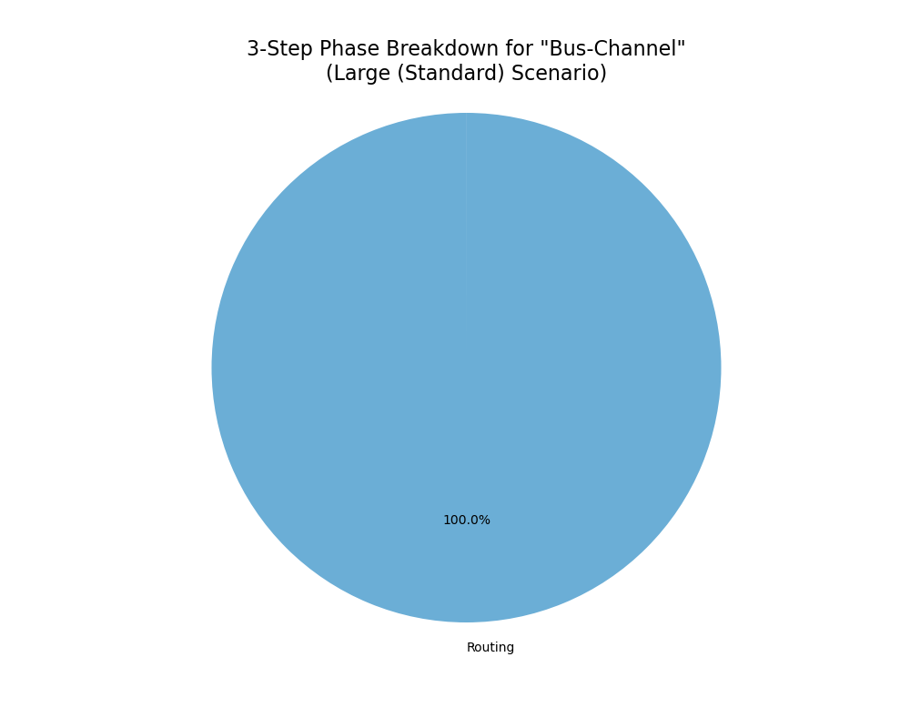
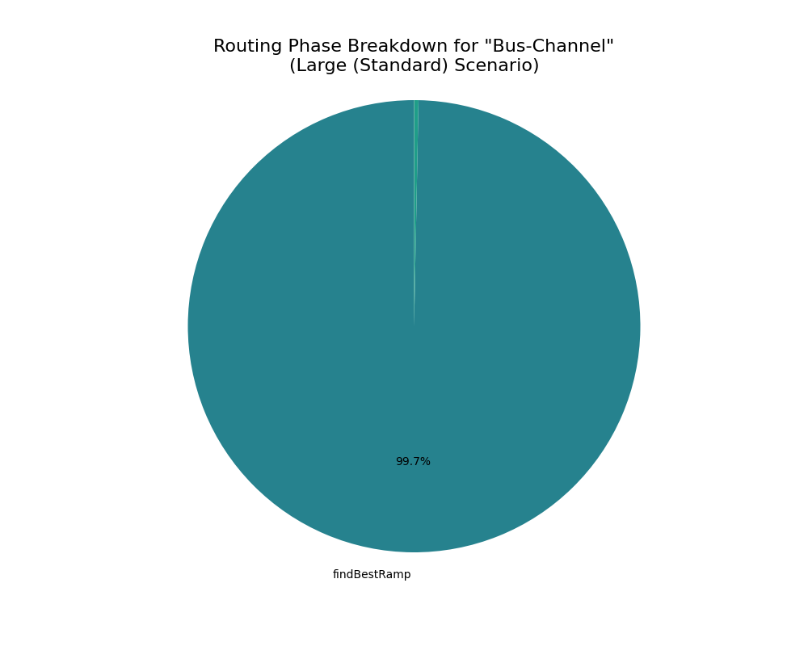
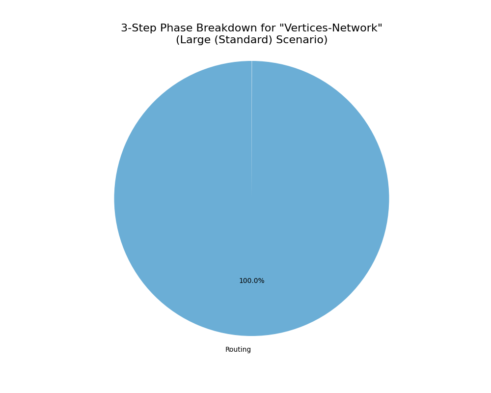
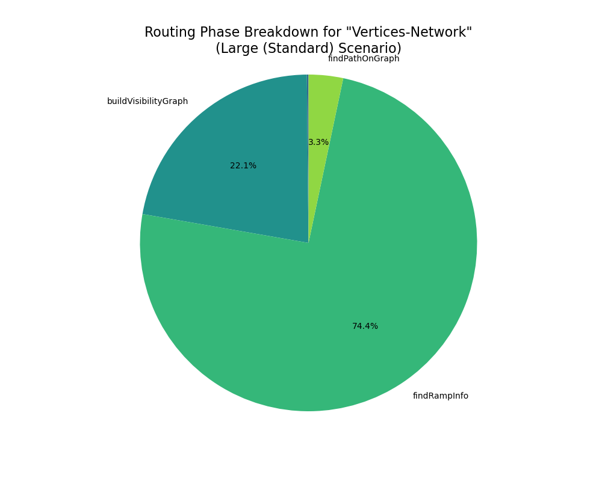

# Performance Benchmark Report

Date: 2025-10-10_10-25-28

## 📈 1. Summary

- **시행 횟수:**
  - `5 (시드) x 3 (시나리오) x 3 (전략)`
- **시드:**

  - `SEEDS = [42, 101, 256, 888, 1337];`

- **전략:**

  - 라우팅 전략 ([`A-Star`](/docs/adr/01-astar-routing-baseline.md), [`Bus-Channel`](/docs/adr/02-bus-channel-routing.md), [`Vertices-Network`](/docs/adr/03-vertices-network-routing.md))

- **시나리오:**

<div align="center">

| 시나리오명       | 노드 수 | 엣지 수 | 그룹 수 | 목적            |
| ---------------- | ------- | ------- | ------- | --------------- |
| Small            | 12      | 18      | 2       | 빠른 피드백     |
| Medium           | 60      | 90      | 3       | 일반적인 케이스 |
| Large (Standard) | 120     | 180     | 4       | 기본 기준       |

<sub>표 1.1. 시나리오</sub>

</div>

### 1.1. Performance Visualization

<div align="center">

<sub>그림 1.1.1. Overall Performance Chart</sub> <br/>
</div>
<br/>

<div align="center">

|                                          |    mean |     std |     min |     max |
| :--------------------------------------- | ------: | ------: | ------: | ------: |
| ('Large (Standard)', 'A-Star')           | 1976.01 |  285.21 | 1736.47 | 2326.72 |
| ('Large (Standard)', 'Bus-Channel')      |   51236 | 18947.4 | 30454.5 | 72868.6 |
| ('Large (Standard)', 'Vertices-Network') | 23371.3 | 3639.31 |   18814 | 27815.3 |
| ('Medium', 'A-Star')                     |  678.15 |  148.98 |  506.77 |  909.78 |
| ('Medium', 'Bus-Channel')                | 25492.1 | 7459.05 |   18394 | 36232.1 |
| ('Medium', 'Vertices-Network')           | 5359.49 | 1325.26 | 3782.38 | 6831.81 |
| ('Small', 'A-Star')                      |   23.36 |    8.88 |   14.35 |   37.68 |
| ('Small', 'Bus-Channel')                 |  452.18 |  129.88 |   302.2 |  560.44 |
| ('Small', 'Vertices-Network')            |   66.24 |   24.69 |   36.43 |  104.74 |

<sub>표 1.1.1 Overall Performance</sub>

</div>
<br/>

### 1.2. Analysis

본 섹션에서는 세 가지 라우팅 전략(`A-Star`, `Bus-Channel`, `Vertices-Network`)의 전반적인 성능을 속도, 확장성, 안정성 측면에서 종합적으로 평가하고 분석합니다.

### 1) 전략별 성능 비교 (Execution Speed)

시나리오별 평균 수행 시간(ms)은 아래와 같습니다.

<div align="center">

| 시나리오             | A-Star (ms) | Bus-Channel (ms) | Vertices-Network (ms) |
| -------------------- | ----------: | ---------------: | --------------------: |
| **Small**            |   **23.36** |           452.18 |                 66.24 |
| **Medium**           |  **678.15** |          25492.1 |               5359.49 |
| **Large (Standard)** | **1976.01** |            51236 |               23371.3 |

<sub>표 1.2.1. Execution Speed</sub>

</div>
<br/>

모든 시나리오에서 `A-Star` **전략이 가장 빠른 수행 속도**를 기록했습니다.  
이는 프로젝트의 성능 기준점(Baseline)으로서 효과적으로 기능하고 있음을 보여줍니다.

반면, `Bus-Channel` 전략은 `Small` 시나리오에서조차 `A-Star` 대비 약 20배 느립니다.  
그래프 규모가 커질수록 격차가 크게 벌어지는 양상을 보입니다.

`Vertices-Network` 전략은 두 전략의 중간 수준의 성능을 보이고 있습니다.

<br/>

### 2) 확장성 분석 (Scalability)

그래프의 복잡도(노드 및 엣지 수) 증가에 따른 수행 시간 변화를 통해 각 전략의 확장성을 평가할 수 있습니다.

#### ① `Bus-Channel`, `Vertices-Network` 전략의 낮은 확장성

`Small`에서 `Large` 시나리오로 규모가 커짐에 따라,
**`Bus-Channel`의 수행 시간은 약 113배 (452.18ms → 51236ms)** 증가했습니다.  
 **`Vertices-Network`의 수행 시간은 약 353배 (66.24ms → 23371.3ms)** 증가했습니다.

이는 그래프 크기에 따라 성능이 기하급수적으로 저하되는, **확장성이 매우 낮은(Poor Scalability)** 구조임을 시사합니다.

> `Vertices-Network`의 수행 시간 자체는 더 짧으나, 그래프 규모에 따라 성능 저하 폭이 가장 크다는 점에서 확장성 개선이 시급한 과제임을 알 수 있습니다.

#### ② `A-Star`

같은 조건에서 **`A-Star`는 약 83배 (23.36ms → 1976.01ms)** 증가했습니다.

<br/>

### 3) 안정성 분석 (Stability)

표준편차(std) 값은 동일 조건에서 테스트를 반복했을 때 결과의 일관성을 나타내는 지표입니다.

<div align="center">

| 전략                 | Large 시나리오 표준편차(std) | 평가                                |
| -------------------- | ---------------------------: | ----------------------------------- |
| **A-Star**           |                   **285.21** | **매우 안정적 (Highly Stable)**     |
| **Bus-Channel**      |                  **18947.4** | **매우 불안정적 (Highly Unstable)** |
| **Vertices-Network** |                      3639.31 | 비교적 안정적 (Relatively Stable)   |

<sub>표 1.2.3. Performance Stability</sub>

</div>
<br/>

`Bus-Channel` 전략은 평균 수행 시간(약 51,236ms)의 37%에 달하는 매우 높은 표준편차를 보입니다.  
이는 동일한 `Large` 시나리오 내에서도 입력 데이터(seed)에 따라 실행 시간이 크게 변동하여 성능을 예측하기 어렵다는 것을 의미합니다.

반면 `A-Star`는 평균 수행 시간(약 1976.01ms)의 14% 정도의 표준편차를 보이며, 그 수치 자체가 가장 낮아, 어떤 입력에 대해서도 일관되고 신뢰성 있는 성능을 제공하는 안정적인 알고리즘으로 평가할 수 있습니다.

`Vertices-Network` 전략은 평균 수행 시간 (약 23371.3ms)의 16% 정도의 표준편차를 보입니다.

<br/>

### 4) 종합 평가 및 결론

- **`A-Star`**  
  현재 가장 빠르고 안정적인 베이스라인 전략입니다.  
  성능이 중요한 환경에서 우선적으로 고려되어야 합니다.

- **`Bus-Channel`**  
  심각한 속도 저하, 낮은 확장성, 높은 불안정성 문제를 모두 가지고 있습니다.  
  _"채널 생성 비용"_ 문제가 실제로 큰 병목이 데이터 상에서도 나타나고 있습니다.

  **권고:** 현재 구현 방식으로는 실사용이 부적합하므로, 알고리즘의 근본적인 재설계 또는 **프로젝트에서의 폐기(Deprecation)를 검토할 필요**가 있습니다.

  > 다만 관련 논문들을 충분히 학습 후, 전역적(Global) 접근 방식을 통해 개선해보고 싶은 방식이기도 합니다.

- **`Vertices-Network`**  
  `A-Star`보다 느리지만, `Bus-Channel`에 비해서는 월등히 나은 성능과 확장성을 보여줍니다.  
  경로 품질의 이점을 고려할 때, 성능 최적화를 진행할 가치가 충분한 전략입니다.
  > 향후 병목 구간을 개선한다면, 속도와 품질을 모두 만족시키는 **주력 전략으로 발전할 잠재력**이 있습니다.

<br/>
<hr/>
<br/>

## 🛠️ 2. Performance for 'Large' Scenario

본 섹션에서는 **성능 병목 지점**을 찾기 위한 세부 측정을 진행합니다.  
우선 정렬을 위한 세 단계(Placement, Routing, Post-Process)를 기준으로 측정합니다.

> 참고 : ADR [00-architecture-overview.md](/docs/adr/00-architecture-overview.md)

이후 병목이 있는 단계에서 더 세부적인 모듈별 측정을 진행합니다.

## 2.1. Strategy: A-Star

### 2.1.1. three step result

<table>
  <tr>
    <td align="center">
    
    <br/>
    <sub>그림 2.1.1. Three Step Phase Breakdown for "A-Star"  </sub>
  </td>
  <td align="center" width="50%">

|              | Average Time (ms) |
| :----------- | ----------------: |
| Placement    |              1.45 |
| Routing      |           1973.63 |
| Post-Process |              0.46 |

<sub>표 2.1.1 Three Step Phase Breakdown for "A-Star"</sub>

  </td>
  </tr>
</table>

<br/>

### 2.1.2. routing breakdown result

<table>
  <tr>
    <td align="center">
     
    <br/>
    <sub>그림 2.1.2. Routing Phase Breakdown for "A-Star"</sub>
  </td>
  <td align="center" width="50%">

|            | Average Time (ms) |
| :--------- | ----------------: |
| buildGrid  |              1.45 |
| aStar_Loop |           1971.92 |

<sub>표 2.1.2. Routing Phase Breakdown for "A-Star" </sub>

  </td>
  </tr>
</table>
<br/>

### 2.1.3. Analysis

`A-Star` 전략은 현재 가장 빠르고 안정적인 성능을 보여주는 베이스라인입니다.  
본 분석에서는 `Large (Standard)` 시나리오를 기준으로 `A-Star` 전략의 내부 동작을 심층 분석하여 현재의 성능 특성과 잠재적인 한계를 진단합니다.

> 참고: [.../legacyAStarStrategy.ts](/src/layout/routing/aStarStrategy/legacyAStarStrategy.ts)

<br/>

#### 1) 병목 지점 식별

- `aStar_Loop`:  
  `표 2.1.2.` 에 따르면, `aStar_Loop`**가 전체 라우팅 시간의 99.9% 차지**  
  이 구간이 `A-Star` 전략의 절대적인 성능 병목 지점

  > `aStar_Loop`는 실제 특정 함수가 아닌, 모든 엣지에 대해 개별적으로 A\* 탐색을 수행하는 반복문 전체를 의미합니다.

- `buildGrid`:  
  `buildGrid`의 부하는 미미한 수준(1.49ms)  
   대부분의 시간이 실제 경로 탐색 로직에 소요

<br/>

#### 2) 호출 흐름 분석

전체적인 호출 흐름은 다음과 같습니다.

```js
LegacyAStarStrategy.execute()
└── routeAll()
    ├── buildGrid()
    └── for (edge of edgesToRoute)    // --- 'aStar_Loop' 프로파일링 구간 ---
        ├── findEntryPointNearNode()  // 경로 시작/끝점 탐색
        └── aStarGrid()               // 단일 엣지에 대한 aStar 탐색 실행
```

> 참고: [.../aStarStrategy/routeAll.ts](/src/layout/routing/aStarStrategy/routeAll.ts)

`routeAll` 함수는 모든 엣지($E$)에 대해 반복하면서, 각 엣지마다 `aStarGrid` 함수를 호출하여 격자 위에서 최적 경로를 탐색합니다.

<br/>

#### 3) 시간 복잡도 분석

<div align="center">

|    **단계**     |   **함수**   |    **복잡도 추정**    | **설명**                            |
| :-------------: | :----------: | :-------------------: | :---------------------------------- |
| **그리드 생성** | `aStarGrid`  |  $O(N \cdot \log N)$  | $N$: 그리드 셀의 총 개수 (탐색공간) |
|    **탐색**     | `aStar_Loop` | $O(E \cdot N \log N)$ | $E$: 모든 엣지의 수                 |

<sub> 2.1.3. Vertices-Network 전략의 시간 복잡도</sub>

</div>
<br/>

- `aStarGrid`는 우선순위 큐를 사용하여 최적화되었습니다.

- 이 탐색을 모든 엣지($E$)에 대해 반복하므로, `aStar_Loop`의 전체 시간 복잡도는 $O(E \cdot N \log N)$ 으로 추정할 수 있습니다.

<br/>

### 3) 결론 및 향후 고려사항

`A-Star` 전략의 시간 복잡도는 그래프의 크기($V$, $E$)에 따라 증가하는 **📌 의사 다항 시간(Pseudo Polynomial Time)** 형태입니다. 이는 `Small`에서 `Large` 시나리오로 넘어갈 때 수행 시간이 크게 증가하는 현상의 근본적인 원인입니다.

<details>

<summary>[📌 자세히 보기 - 의사 다항 시간이란?]</summary>

<br/>

- **다항 시간(Polynomial Time)**

  - 개념: 알고리즘의 실행 시간을 평가할 때, 보통 입력의 '**개수**'($n$)에만 의존하면 '**다항 시간**'이라고 합니다.

- **의사 다항 시간(Pseudo Polynomial Time):**

  - 개념: '**의사 다항 시간**'은 입력의 '**개수**'뿐만 아니라 입력 '**값**'의 크기에도 실행 시간이 비례하는 경우를 말합니다.
  - 예시: [1, 1000] 두 숫자가 담긴 배열을 처리할 때, 입력의 개수는 단지 2지만, 숫자 1000이라는 값 때문에 1000번에 가까운 연산을 해야 한다면 이는 **의사 다항 시간 알고리즘**입니다.

- **`A_Star` 알고리즘과 의사 다항 시간:**

  - 현재 A\* 알고리즘이 바로 여기에 해당합니다. `aStar_Loop`의 시간 복잡도는 $O(E \cdot N \log N)$ 입니다. 여기서 $N$은 그리드 셀의 총 '**개수**'를 의미하는데, 이 $N$의 크기가 바로 노드의 좌표 '**값**'에 의해 결정됩니다.

  - 왜냐하면 노드가 두 개 뿐이라도, 그 간격이 매우 크다면, 그리드 셀의 개수 $N$ 은 단순히 노드 수 $V$ 가 아니라, 노드들이 차지하는 공간의 범위(최대/최소 좌표)에 비례하여 커지기 때문입니다.

<br/>

[📌 자세히 보기 - 의사 다항 시간이란?] 끝

---

</details>
<br/>

현재는 가장 효율적인 전략이지만, 향후 더 복잡하고 거대한 그래프(수천 개 이상의 노드/엣지)를 처리해야 할 경우, 모든 엣지를 개별적으로 탐색하는 현재 방식은 결국 성능 한계에 도달할 수 있습니다.

따라서 장기적인 관점에서, 개별 엣지 탐색에서 벗어나 여러 엣지의 경로를 동시에 또는 더 효율적으로 결정할 수 있는 **전역적(Global) 접근 방식의 필요성을 고려**해야 합니다.  
이는 `Bus-Channel`이나 `Vertices-Network`가 해결하고자 했던 문제이기도 하며, 해당 전략들의 실패 원인을 분석하여 `A-Star`의 장점과 결합하는 새로운 하이브리드 전략을 구상하는 방향으로 이어질 수 있습니다.

<br/>
<hr/>
<br/>

## 2.2. Strategy: Bus-Channel

### 2.2.1. three step result

<table>
  <tr>
    <td align="center">
     <br/>
    <sub>그림 2.2.1. Three Step Phase Breakdown for "Bus-Channel"</sub> 
  </td>
  <td align="center" width="50%">

|              | Average Time (ms) |
| :----------- | ----------------: |
| Placement    |              1.54 |
| Routing      |             51233 |
| Post-Process |               0.8 |

<sub> 표 2.2.1. Routing Phase Breakdown for "Bus-Channel"</sub>

  </td>
  </tr>
</table>
<br/>

### 2.2.2. routing breakdown result

<table>
  <tr>
    <td align="center">
     <br/>
    <sub>그림 2.2.2. Routing Phase Breakdown for "Bus-Channel"</sub>
  </td>
  <td align="center" width="50%">

|                      | Average Time (ms) |
| :------------------- | ----------------: |
| createBusChannels    |                 3 |
| buildBusNetworkGraph |              0.04 |
| findRampCandidates   |               6.4 |
| findBestRamp         |             51063 |
| findBestOffRamp      |            156.98 |
| findBusRoute         |              0.53 |
| stitchPath           |              1.11 |
| Routing Fallback     |              0.37 |

<sub> 표 2.2.2. Routing Phase Breakdown for "Bus-Channel"</sub>

  </td>
  </tr>
</table>
<br/>

### 2.2.3. Analysis

`Bus-Channel` 전략은 그림1.에서 확인되었듯이, 가장 느린 수행 시간과 심각한 확장성 문제를 보였습니다.  
본 섹션에서는 `Large (Standard)` 시나리오를 기준으로 성능 저하의 근본 원인을 코드 호출 구조와 시간 복잡도 측면에서 심층적으로 분석합니다.

> 참고: [.../busRoutingStrategy.ts](/src/layout/routing/busStrategy/busRoutingStrategy.ts)

<br/>

#### 1) 병목 지점 식별

`표 2.2.2.` 에서 `findBestRamp` **가 라우팅 시간의 99.7%를 차지**하는 압도적인 병목 구간임을 확인했습니다.

> 참고 : ADR 문서(docs/adr/02-bus-channel-routing.md)
> 예측했던 것 이상으로, 실제 라우팅 과정 자체에 근본적인 비효율이 존재

<br/>

#### 2) 호출 흐름 분석

`Bus-Channel` 전략의 전체적인 호출 흐름은 아래와 같이 구성됩니다.

```js
BusRoutingStrategy.execute()
└── routeEdgesOnBus()
    └── for (edge of out.edges.values()) // --- 1. 모든 엣지(E)에 대해 반복 ---
        └── findPathForEdge(edge, ...)
            ├── findRampCandidates(targetNode) // 2. Off-Ramp 후보 탐색 (Ports * Channels)
            │
            └── findBestRamp(sourceNode, offRampCandidates) // [‼️ 병목 지점 ‼️]
                ├── findRampCandidates(sourceNode) //  3. On-Ramp 후보 탐색 (Ports * Channels)
                │
                └── for (onRamp of onRampCandidates) // --- 4. 모든 On-Ramp 후보에 대해 반복 ---
                    └── findCheapestRouteToCandidates(onRamp, offRampCandidates)
                        └── for (offRamp of offRampCandidates) // --- 5. 모든 Off-Ramp 후보에 대해 반복 ---
                            └── findBusRoute(onRamp, offRamp) // 6. 채널 네트워크 A* 탐색 (Inetersection * log Channel)
```

- **1~3단계 (후보군 생성):**  
  하나의 엣지를 처리하기 위해, 시작 노드와 도착 노드의 모든 포트($P$)와 모든 채널($C$)을 조합하여 수많은 **진입(On-Ramp) 및 진출(Off-Ramp) 후보를 생성**합니다.  
  후보군의 수는 $O(P C)$ 에 비례합니다.

- **4~5단계 (최적 조합 탐색):** [‼️ 병목 지점 ‼️]
  최적의 경로를 찾기 위해, 생성된 모든 On-Ramp 후보와 모든 Off-Ramp 후보의 조합을 **완전 탐색(Brute-force)** 합니다.  
  이 과정에서 `findBusRoute`(채널 A\*) 함수가 $R_{on} \cdot R_{off}$ 만큼 반복 호출됩니다.  
  ($R$은 Ramp 후보 수)

- **6단계 (경로 탐색):**  
  각각의 조합마다 채널 네트워크 상에서 A\* 탐색을 수행합니다.

<br/>

위 호출 구조에서 `findBestRamp`는 최적의 진입로(On-Ramp)를 찾기 위해, 가능한 모든 진입로 후보와 모든 진출로(Off-Ramp) 후보의 조합을 탐색합니다.
따라서 각 단계의 연산량이 그래프의 크기가 커짐에 따라 급격히 증가하는 조합 폭발(Combinatorial Explosion)로 인한 심각한 성능 저하를 유발합니다.

<br/>

#### 3) 시간 복잡도 분석

`routeEdgesOnBus`의 전체적인 시간 복잡도는 각 단계의 복잡도를 곱한 형태로 나타낼 수 있습니다.

<div align="center">

|          단계           |                  함수                  | 복잡도 추정                          | 설명                                                                                                            |
| :---------------------: | :------------------------------------: | ------------------------------------ | :-------------------------------------------------------------------------------------------------------------- |
|      **엣지 반복**      |           `routeEdgesOnBus`            | $O(E)$                               | $E$ : 전체 엣지 수                                                                                              |
|   **Ramp 후보 생성**    |          `findRampCandidates`          | $O(R_{on, off})$ = $O(P C)$          | $P$ : 노드 포트 수 <br/> $C$ : 전체 채널 수 <br/> $R_{on}$ : On-Ramp 후보 수 <br/> $R_{off}$ : Off-Ramp 후보 수 |
| **최적 Ramp 조합 탐색** | `findBestRamp` <br/> [‼️ 병목 지점 ‼️] | $O((P  C)^2 \cdot I \log C)$         | $R_{on} \cdot R_{off} \cdot$ A\* 채널 탐색 📌 <br/> $I$ : 채널 교차점의 수                                      |
|        **총계**         |                   -                    | $O(E \cdot (P  C)^2 \cdot I \log C)$ | 최종 추정 복잡도                                                                                                |

<sub> 표 2.2.3. routeEdgesOnBus 시간 복잡도 분석 </sub>

</div>

<details>
<summary>[📌 자세히 보기 - A* 채널 탐색 시간 복잡도 : O(I*log C) 근사에 대하여] 
</summary>

- **A-Star 탐색 대상:** 채널 네트워크

  - `findBusRoute` 함수에서 수행하는 A\* 탐색은 기존처럼 노드-엣지 그래프를 탐색하는 게 아닙니다.
  - 대신 채널(Channel, $C$)과 교차점(Intersection, $I$)로 이루어진, **도로망 지도**를 탐색합니다.

- **시간 복잡도:** A-Star 알고리즘의 시간 복잡도는 일반적으로 $O($ |간선 수| + |정점 수| $\log$ |정점 수| $)$ 로 표현됩니다.

  - 따라서 `Bus-Channel`방식에 대입하면,
  - |정점 수| = $C$ (전체 체널의 개수)
  - |간선 수| = $I$ (교차점의 개수)

  따라서 `findBusRoute`에서의 A\* 알고리즘의 시간 복잡도 $O(I + C \log C)$ 입니다.

- $\log C$ :
  - 우선순위 큐 연산 비용 (Min Heap 사용)
  - 비용이 가장 낮은 채널을 항상 최상단(첫번째 요소)에 유지
- $I$ : 탐색 과정 비용

  - 알고리즘이 최적의 경로를 찾으려면, 현재 채널에 연결된 모든 교차점을 따라 다음 채널로 이동하는 과정을 반복해야 합니다
  - 최악의 경우, 지도에 있는 거의 모든 교차점을 한 번씩은 확인하게 될 수 있습니다. 따라서 전체 교차점의 수($I$)가 연산량에 직접적인 영향을 미칩니다.

- 표에서는 이 수식을 $O(I + C \log C )$ 로 간소화하여 표현했는데, 이는 그래프가 충분히 연결되어 있을 때 $I$가 $C$보다 크거나 비슷한 경향이 있어 $I$ 항이 전체 복잡도를 주도하는 경우가 많기 때문입니다. 하지만 더 정확한 표현은 $O(I + C \log C)$ 입니다.

- 그리고 이 과정 전체가 $(P \cdot C)^2$ 만큼 반복되고, 다시 전체 엣지 수 $E$ 만큼 반복되니 최종적인 시간 복잡도가 기하급수적으로 커지는 것입니다.

[📌 자세히 보기 - A* 채널 탐색 시간 복잡도 : O(I*log C) 근사에 대하여] 끝

---

</details>
<br/>

⚠️ 다른 방식에 비하여 채널 수($C$)와 포트 수($P$)에 대해 다항식 이상의 매우 높은 복잡도를 가집니다.

결론적으로, 그래프의 노드($V$)와 엣지($E$)가 증가하면 채널($C$)과 포트($P$)의 수도 함께 증가하여, 전체 연산량이 **기하급수적으로 늘어나는 구조**입니다. 이것이 `Bus-Channel` 전략의 극심한 성능 저하와 낮은 확장성의 근본적인 원인입니다.

<br/>

#### 4) 결론

`Bus-Channel` 전략의 성능 문제는 특정 코드 라인의 비효율성이 아닌, **알고리즘 설계 자체의 구조적인 결함**에 기인합니다.
모든 엣지에 대해 독립적으로, 가능한 모든 경로 조합을 탐색하는 현재의 접근 방식은 대규모 그래프 환경에서 실용적이지 않습니다.

- **권고:** 만약 이 전략의 개념(공통 통로 활용)을 유지하고자 한다면, 개별 엣지 단위의 탐색이 아닌, 모든 엣지의 경로를 동시에 최적화하는 전역적(Global) 접근 방식 도입이 필요합니다.

<br/>
<hr/>
<br/>

## 2.3. Strategy: Vertices-Network

### 2.3.1. three step result

<table>
  <tr>
    <td align="center">
    
    <br/>
    <sub>그림 2.3.1. Three Step Phase Breakdown for "Bus-Channel"</sub>
  </td>
  <td align="center" width="50%">

|              | Average Time (ms) |
| :----------- | ----------------: |
| Placement    |              1.58 |
| Routing      |           23359.1 |
| Post-Process |              9.83 |

<sub> 표 2.3.1. Routing Phase Breakdown for "Bus-Channel"</sub>

  </td>
  </tr>
</table>
<br/>

### 2.3.2. routing breakdown result

<table>
  <tr>
    <td align="center">
    
    <br/>
    <sub>그림 2.3.2. Routing Phase Breakdown for "Vertices-Network"</sub>
  </td>
  <td align="center" width="50%">

|                       | Average Time (ms) |
| :-------------------- | ----------------: |
| stitchPath            |              1.35 |
| createRoutingVertices |             35.68 |
| buildVisibilityGraph  |           5161.09 |
| findRampInfo          |          17385.20 |
| findPathOnGraph       |            772.12 |

<sub> 표 2.3.2. Routing Phase Breakdown for "Bus-Channel"</sub>

  </td>
  </tr>
</table>
<br/>

### 2.3.3. Analysis

`Vertices-Network` 전략은 `A-Star`의 속도와 `Bus-Channel`의 경로 품질 사이의 절충안으로 설계되었습니다. 비록 `A-Star`보다는 느리지만, `Bus-Channel`보다는 훨씬 뛰어난 확장성을 보여주어 최적화를 통해 주력 전략으로 발전할 잠재력을 가지고 있습니다.

> 참고: [.../verticesRoutingStrategy.ts](/src/layout/routing/verticesStrategy/verticesRoutingStrategy.ts)

<br/>

#### 1) 병목 지점 식별

`표 2.3.2.`에 따르면, 라우팅 단계의 성능 부하는 크게 두 개의 함수에 집중되어 있습니다.

- `findRampInfo:`  
  가장 큰 병목 구간으로, 각 엣지의 시작/끝 노드에 가장 적합한 진입/진출 정점을 찾는 역할을 합니다.  
  (17,385ms, 74.4%)

- `buildVisibilityGraph`  
  라우팅을 위한 가시성 그래프(네트워크)를 구축하는 사전 준비 단계입니다.  
  (약 5,161ms 22.1%)

`createRoutingVertices`(약 36ms)의 비중은 미미하며, 성능 문제는 **그래프 생성**과 **진입/진출로 탐색**이라는 두 핵심 과정에 있음을 알 수 있습니다.

<br/>

#### 2) 호출 흐름 분석

`Vertices-Network` 전략의 전체적인 호출 흐름은 3단계로 구성됩니다.

```js
VerticesRoutingStrategy.execute()
├── createRoutingVertices()      // 1. 라우팅 정점 생성
├── buildVisibilityGraph()       // 2. 가시성 그래프 구축 (1차 병목)
└── routeOnVisibilityGraph()     // 3. 그래프 기반 경로 탐색 (2차 병목)
    └── for (edge of edgesToRoute)
        ├── findRampInfo()       // [‼️ 병목 지점 ‼️]
        └── findPathOnGraph()    // A* on Visibility Graph
```

**① buildVisibilityGraph (1차 병목):**

이 함수는 생성된 모든 라우팅 정점($V_r$)들을 대상으로, 서로 장애물에 가려지지 않는(visible) 쌍을 찾아 간선으로 연결하는 역할을 합니다.

> 참고: [.../visibility.ts](/src/layout/routing/verticesStrategy/visibility.ts)

현재 구현은 동일한 축(x 또는 y)에 정렬된 정점 그룹 내에서 모든 쌍을 순회하며 `isPathObstructed` 함수를 호출합니다. `isPathObstructed는` 다시 모든 장애물($O$)을 확인하므로, 이 과정의 계산량이 상당합니다.  
가시성 그래프의 간선 수($E_v$)가 $V_r^2$에 가깝게 증가할 수 있어, 그래프 규모가 커질수록 이 단계의 부하가 증가합니다.

<br/>

**② routeOnVisibilityGraph (2차 병목):**

이 함수는 `A-Star` 전략과 유사하게, 그래프의 모든 엣지($E$)에 대해 개별적으로 경로 탐색을 수행합니다.

> 참고: [.../router.ts](/src/layout/routing/verticesStrategy/router.ts)

`A-Star` 전략과의 차이점은, 전체 그리드가 아닌 미리 계산된 **가시성 그래프** 위에서 탐색(`findPathOnGraph`)을 수행한다는 점입니다. 탐색 공간 자체는 작아졌지만, 이 탐색을 모든 엣지에 대해 반복해야 하므로 여전히 $O(E)$ 에 비례하는 부하가 발생합니다.

<br/>

#### 3) 시간 복잡도 분석

<div align="center">

|    **단계**     |         **함수**         |         **복잡도 추정**          |                                                      **설명**                                                      |
| :-------------: | :----------------------: | :------------------------------: | :----------------------------------------------------------------------------------------------------------------: |
|  **정점 생성**  | `createRoutingVertices`  |    $O(A_x \cdot A_y \cdot O)$    |                $A_x$: X축의 개수 <br/> $A_y$: Y축의 개수 <br/> $O$: 장애물(노드 및 그룹)의 총 개수                 |
| **그래프 구축** |  `buildVisibilityGraph`  |        $O(V_r^2 \cdot O)$        |                          $V_r$: 생성된 전체 라우팅 정점의 수 <br/> $O$: 장애물의 총 개수                           |
|  **경로 탐색**  | `routeOnVisibilityGraph` | $O(E \cdot(E_v + V_r \log V_r))$ | $E$: 라우팅할 전체 엣지의 수 <br/> $E_v$: 가시성 그래프 내 간선의 수 <br/> $V_r$: 가시성 그래프 내 정점의 수 <br/> |

<sub> 표 2.3.3. Vertices-Network 전략의 시간 복잡도</sub>

</div>
<br/>

⚠️ 그래프 구축 단계에서 `buildVisibilityGraph`의 실제 복잡도는 [📌 정렬을 통해 최적화]되어 있습니다.  
하지만 정점과 장애물 수가 늘어남에 따라 다항 시간으로 증가하는 경향은 동일합니다.

<details>
<summary>[📌 자세히 보기 - 정렬 기반 최적화] 
</summary>

- **위치:** [.../visibility.ts](/src/layout/routing/verticesStrategy/visibility.ts) 내부 `connectAlignedVertices`함수

- **아이디어:** "어차피 수평/수직 연결만 보니까, 같은 선상에 있는 정점들만, 그것도 바로 옆에 있는 정점들끼리만 확인하자"

- **효과:** 모든 정점 쌍($O(V_r^2)$)을 무작위로 검사하는 대신,  
  정점들을 축을 기준으로 정렬한 뒤, 바로 옆에 있는 인접한 쌍($O(V_r)$)만 검사함으로써 불필요한 비교 연산을 극적으로 줄여 성능을 향상

- **동작 방식:**  
  ① 축(Axis) 기준으로 그룹화:

  - 먼저 모든 정점을 y좌표에 따라 그룹화

  ```js
  // 수평 연결
  const verticesByY = new Map<number, RoutingVertex[]>();
  for (const v of vertexGroup) {
    const yKey = Math.round(v.y);
    if (!verticesByY.has(yKey)) verticesByY.set(yKey, []);
    verticesByY.get(yKey)!.push(v);
  }
  ```

  ② 정렬 (Sort):

  - 동일한 y좌표를 가진 그룹 내에서, 정점들을 x좌표 순서대로 정렬

  ```js
  for (const yGroup of verticesByY.values()) {
    yGroup.sort((a, b) => a.x - b.x); // <-- '정렬'을 통한 최적화
    // ...
  }
  ```

  ③ 인접(Adjacent) 쌍만 검사:

  - 이제 모든 쌍을 비교하는 대신, **바로 옆에 있는 정점 (`i`와 `i+1`)** 사이만 확인
  - 만약 두 사이에 장애물이 있다면, 그보다 더 먼 `i+2` 는 확인할 필요 없이 막혀있음
  - 이 과정은 수직 연결을 찾기 위해 x좌표로 그룹화하고 y좌표로 정렬하는 방식에서도 동일하게 반복

  ```js
  // 모든 쌍(i, j)이 아닌, 인접한 쌍(i, i+1)만 확인
  for (let i = 0; i < yGroup.length - 1; i++) {
    // running tech
    const v1 = yGroup[i],
      v2 = yGroup[i + 1];
    if (!isPathObstructed(v1, v2, obstacles)) {
      // 연결 가능한 경우에만 간선을 추가
      graph.adjacency.get(v1.id)!.push(v2.id);
      graph.adjacency.get(v2.id)!.push(v1.id);
    }
  }
  ```

[📌 자세히 보기 - 정렬 기반 최적화] 끝

---

</details>

<br/>

`Bus-Channel`과 같은 조합 폭발 문제는 없지만, **그래프 구축**과 **개별 엣지 탐색 과정** 모두에서 다항식의 복잡도를 가지므로 노드 수가 증가함에 따라 수행 시간이 길어집니다.

<br/>

#### 4) 결론

`Vertices-Network` 전략은 `A-Star`보다 느리지만, 사전 계산된 네트워크를 활용하여 더 정돈된 경로를 생성할 잠재력을 가진, **성능과 품질의 트레이드오프 관계**에 있는 전략입니다. 현재의 성능은 `Large` 시나리오에서 수십 초가 소요되어 개선이 반드시 필요합니다.

주요 최적화 대상은 `buildVisibilityGraph`와 `routeOnVisibilityGraph`입니다.

- `buildVisibilityGraph` **개선:**
  - 현재의 중첩 반복문 구조 대신, 기하학적 탐색에 효율적인 **Sweep-line 알고리즘** 등을 도입하여 가시성 검사 속도를 $O(V_r \log V_r)$ 수준으로 개선하는 것을 고려할 수 있습니다.
- `routeOnVisibilityGraph` **개선:**
  - `A-Star` 전략과 마찬가지로, 모든 엣지를 개별적으로 탐색하는 것이 가장 큰 부하의 원인입니다. 출발지와 목적지가 유사한 엣지들을 그룹으로 묶어 **경로를 공유하거나 재활용**하는 기법을 도입하여 A\* 호출 횟수를 줄이는 것이 효과적일 수 있습니다.

이러한 개선은 `docs/adr/03-vertices-network-routing.md`에서 언급한 "단순 경로 최적화 필요", "안전 지역 내 정점 생성 문제 해결" 등의 과제와도 직접적으로 연결됩니다.

이 병목 구간들이 해결된다면, `Vertices-Network`는 `A-Star`의 속도에 근접하면서도 더 높은 품질의 결과를 제공할 수 있을 것입니다.

<br/>
<hr/>
<br/>

## 3. 향후 개선 방향

### 3.1. 단기 목표

#### 3.1.1. Vertices-Network 전략 최적화:

- **`findRampInfo` 함수 개선:**  
  현재 74.4%의 가장 큰 병목인 이 함수는 모든 정점을 순회하며 최적의 진입점을 찾고 있습니다. 이를 공간 분할 자료구조(예: Quadtree, k-d tree)를 활용하여 특정 노드 주변의 정점만 효율적으로 탐색하도록 개선하면, 탐색 범위를 줄여 성능을 크게 향상시킬 수 있습니다.

- **`buildVisibilityGraph` 알고리즘 교체:**  
  현재 구현은 정렬을 통해 최적화되었지만, 더 효율적인 Sweep-line 알고리즘을 도입하여 가시성 그래프 구축 시간을 단축할 수 있습니다. 이는 복잡한 그래프에서 더 큰 효과를 볼 것입니다.

<br/>

### 3.2. 중기 목표

#### 3.2.1. 전역적 경로 탐색(Global Routing) 도입:

- **`Bus-Channel`과 `Vertices-Network`의 확장성 문제 해결:**  
  두 전략 모두 모든 엣지를 개별적으로 탐색하는 현재 구조($O(E \cdot ...)$)는 근본적인 확장성 한계를 가집니다. 이를 해결하기 위해, 출발지와 목적지가 유사한 엣지들을 그룹으로 묶어 **경로를 공유하거나 재활용**하는 기법을 도입을 고려해야합니다.
  이를 통해 A\* 탐색 호출 횟수를 줄여 전체 성능을 개선 효과를 기대할 수 있습니다.

#### 3.2.2. **`Bus-Channel` 전략의 재설계 또는 폐기:**

- 현재의 `findBestRamp` 함수는 알고리즘 설계 자체의 결함으로 인해 실사용이 불가능한 수준의 성능을 보입니다. 만약 이 전략의 '공통 통로' 개념을 유지하려면, 개별 엣지 단위가 아닌 모든 엣지의 경로를 동시에 최적화하는 **전역적 접근 방식(Global Routing)** 으로 완전히 재설계해야 합니다. 현실적으로 어렵다면, 리소스 낭비를 막기 위해 과감히 **프로젝트에서 폐기(Deprecate)** 하는 것을 검토해야 합니다.

<br/>

### 3.3. 장기 목표

#### 3.3.1. 하이브리드(Hybrid) 전략 개발:

- 각 전략의 장점을 결합한 새로운 하이브리드 전략을 구상할 수 있습니다. 예를 들어, `Vertices-Network`로 전체적인 경로의 뼈대를 잡고, 복잡한 구간이나 실패한 경로는 `A-Star`로 마무리하는 방식입니다. 이는 품질과 성능의 균형을 맞춘 최종 해결책이 될 수 있습니다.

<br/>

이러한 개선 방향을 통해 현재의 성능 병목을 해결하고, 더 복잡하고 큰 규모의 그래프에서도 안정적으로 고품질의 레이아웃을 생성하는 것을 목표로 하고자 합니다.
