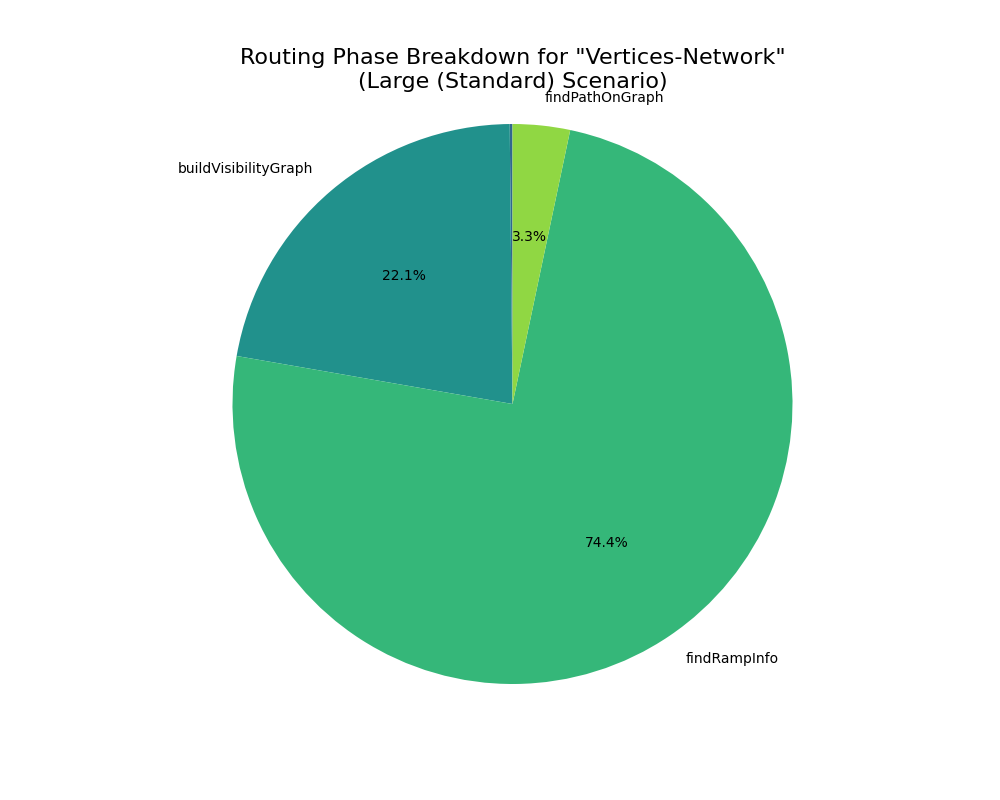

# Performance Benchmark Report

Date: 2025-10-10_10-25-28

## 📈 1. Summary
아래와 같은 시나리오에 대해, 각 라우팅 전략별로 

| 시나리오명       | 노드 수 | 엣지 수 | 그룹 수 | 목적             |
| ---------------- | ------- | ------- | ------- | ---------------- |
| Small            | 12      | 18      | 2       | 빠른 피드백      |
| Medium           | 60      | 90      | 3       | 일반적인 케이스  |
| Large (Standard) | 120     | 180     | 4       | 기본 기준        |

> 현재 Large 까지만 우선 분석

### 1.1. Performance Visualization

<div align="center">

<sub>그림 1.1. Overall Performance Chart</sub> <br/>
</div>
<br/>

<div align="center">

|                                          |    mean |     std |     min |     max |
| :--------------------------------------- | ------: | ------: | ------: | ------: |
| ('Large (Standard)', 'A-Star')           | 1976.01 |  285.21 | 1736.47 | 2326.72 |
| ('Large (Standard)', 'Bus-Channel')      |   51236 | 18947.4 | 30454.5 | 72868.6 |
| ('Large (Standard)', 'Vertices-Network') | 23371.3 | 3639.31 |   18814 | 27815.3 |
| ('Medium', 'A-Star')                     |  678.15 |  148.98 |  506.77 |  909.78 |
| ('Medium', 'Bus-Channel')                | 25492.1 | 7459.05 |   18394 | 36232.1 |
| ('Medium', 'Vertices-Network')           | 5359.49 | 1325.26 | 3782.38 | 6831.81 |
| ('Small', 'A-Star')                      |   23.36 |    8.88 |   14.35 |   37.68 |
| ('Small', 'Bus-Channel')                 |  452.18 |  129.88 |   302.2 |  560.44 |
| ('Small', 'Vertices-Network')            |   66.24 |   24.69 |   36.43 |  104.74 |

<sub>표 1.1. Overall Performance</sub>

</div>
<br/>

### 1.2. Analysis

본 섹션에서는 세 가지 라우팅 전략(`A-Star`, `Bus-Channel`, `Vertices-Network`)의 전반적인 성능을 속도, 확장성, 안정성 측면에서 종합적으로 평가하고 분석합니다.

### 1) 전략별 성능 비교 (Execution Speed)

시나리오별 평균 수행 시간(ms)은 아래와 같습니다.

<div align="center">

| 시나리오             | A-Star (ms) | Vertices-Network (ms) | Bus-Channel (ms) |
| -------------------- | ----------- | --------------------- | ---------------- |
| **Small**            | **23.8**    | 69.28                 | 461.61           |
| **Medium**           | **594.48**  | 5262.77               | 24962.00         |
| **Large (Standard)** | **1975.16** | 23762.40              | 51692.80         |

<sub>표 1.2.1. Execution Speed</sub>

</div>
<br/>

모든 시나리오에서 `A-Star` **전략이 가장 빠른 수행 속도**를 기록했으며, 이는 프로젝트의 성능 기준점(Baseline)으로서 효과적으로 기능하고 있음을 보여줍니다.  
반면, `Bus-Channel` 전략은 Small 시나리오에서조차 `A-Star` 대비 약 20배 느리며, 그래프 규모가 커질수록 격차가 크게 벌어지는 양상을 보입니다.  
`Vertices-Network` 전략은 두 전략의 중간 수준의 성능을 보이고 있습니다.

<br/>

### 2) 확장성 분석 (Scalability)

그래프의 복잡도(노드 및 엣지 수) 증가에 따른 수행 시간 변화를 통해 각 전략의 확장성을 평가할 수 있습니다.

#### ① `Bus-Channel` 전략의 낮은 확장성

`Small`에서 `Large` 시나리오로 규모가 커짐에 따라, **`Bus-Channel`의 수행 시간은 약 112배 (461ms → 51692ms)** 증가했습니다.  
이는 그래프 크기에 따라 성능이 기하급수적으로 저하되는, **확장성이 매우 낮은(Poor Scalability)** 구조임을 시사합니다.  
대규모 그래프 환경에서는 현실적으로 사용하기 어려운 수준의 성능 저하입니다.

#### ② `A-Star` 및 `Vertices-Network`의 상대적 우수성

같은 조건에서 **`A-Star`는 약 83배**, **`Vertices-Network`는 약 343배** 증가했습니다.  
`Vertices-Network` 역시 증가 폭이 작지는 않으나, `Bus-Channel`과 같은 극단적인 성능 저하 패턴은 보이지 않습니다.

<br/>

### 3) 안정성 분석 (Stability)

표준편차(std) 값은 동일 조건에서 테스트를 반복했을 때 결과의 일관성을 나타내는 지표입니다.

<div align="center">

| 전략                 | Large (Standard) 시나리오 표준편차(std) | 평가                                |
| -------------------- | --------------------------------------- | ----------------------------------- |
| **A-Star**           | **289.56**                              | **매우 안정적 (Highly Stable)**     |
| **Vertices-Network** | 4040.09                                 | 비교적 안정적 (Relatively Stable)   |
| **Bus-Channel**      | **17894.80**                            | **매우 불안정적 (Highly Unstable)** |

<sub>표 1.2.3. Performance Stability</sub>

</div>
<br/>

`Bus-Channel` 전략은 평균 수행 시간(약 51,692ms)의 35%에 달하는 매우 높은 표준편차를 보입니다.  
이는 동일한 Large 시나리오 내에서도 입력 데이터(seed)에 따라 실행 시간이 크게 변동하여 성능을 예측하기 어렵다는 것을 의미합니다.  
반면 `A-Star`는 표준편차가 가장 낮아, 어떤 입력에 대해서도 일관되고 신뢰성 있는 성능을 제공하는 안정적인 알고리즘으로 평가할 수 있습니다.

<br/>

### 4) 종합 평가 및 결론

- **`A-Star`**  
  현재 가장 빠르고 안정적인 베이스라인 전략입니다. 성능이 중요한 환경에서 우선적으로 고려되어야 합니다.

- **`Bus-Channel`**  
  심각한 속도 저하, 낮은 확장성, 높은 불안정성 문제를 모두 가지고 있습니다.  
  _"채널 생성 비용"_ 문제가 실제로 큰 병목이 데이터 상에서도 나타나고 있습니다.

  > ADR 문서(`docs/adr/02-bus-channel-routing.md`)

  **권고:** 현재 구현 방식으로는 실사용이 부적합하므로, 알고리즘의 근본적인 재설계 또는 **프로젝트에서의 폐기(Deprecation)를 검토할 필요**가 있습니다. (다만 가독성 측면의 가치는 고려할 부분이라고 생각합니다.)

- **`Vertices-Network`**  
  `A-Star`보다 느리지만, `Bus-Channel`에 비해서는 월등히 나은 성능과 확장성을 보여줍니다.  
  경로 품질의 이점을 고려할 때, 성능 최적화를 진행할 가치가 충분한 전략입니다.
  > ADR 문서 (`docs/adr/03-vertices-network-routing.md`)
  > 향후 상세 분석을 통해 병목 구간을 개선한다면, 속도와 품질을 모두 만족시키는 **주력 전략으로 발전할 잠재력**이 있습니다.

<br/>
<hr/>
<br/>

## 🛠️ 2. Performance for 'Large' Scenario

본 섹션에서는 **성능 병목 지점**을 찾기 위해, 알고리즘 단계별(Placement, Routing, Post-Process), 모듈별 측정을 진행합니다.

## 2.1. Strategy: A-Star

### 2.1.1. three step result

<table>
  <tr>
    <td align="center">
    
    <br/>
    <sub>그림 2.1.1. Three Step Phase Breakdown for "A-Star"  </sub>
  </td>
  <td align="center" width="50%">

|              | Average Time (ms) |
| :----------- | ----------------: |
| Placement    |              1.45 |
| Routing      |           1973.63 |
| Post-Process |              0.46 |

<sub>표 2.1.1 Three Step Phase Breakdown for "A-Star"</sub>

  </td>
  </tr>
</table>

<br/>

### 2.1.2. routing breakdown result

<table>
  <tr>
    <td align="center">
     
    <br/>
    <sub>그림 2.1.2. Routing Phase Breakdown for "A-Star"</sub>
  </td>
  <td align="center" width="50%">

|            | Average Time (ms) |
| :--------- | ----------------: |
| buildGrid  |              1.45 |
| aStar_Loop |           1971.92 |

<sub>표 2.1.2. Routing Phase Breakdown for "A-Star" </sub>

  </td>
  </tr>
</table>
<br/>

### 2.1.3. Analysis

`A-Star` 전략은 현재 가장 빠르고 안정적인 성능을 보여주는 베이스라인입니다.  
본 분석에서는 `Large (Standard)` 시나리오를 기준으로 `A-Star` 전략의 내부 동작을 심층 분석하여 현재의 성능 특성과 잠재적인 한계를 진단합니다.

> 참고: src/layout/routing/aStarStrategy/legacyAStarStrategy.ts

<br/>

#### 1) 병목 지점 식별

- `aStar_Loop`:  
  `표 5.` 에 따르면, `aStar_Loop`**가 전체 라우팅 시간의 99.9% 차지**  
  이 구간이 `A-Star` 전략의 절대적인 성능 병목 지점

- `buildGrid`:  
  `buildGrid`의 부하는 미미한 수준(1.49ms)  
   대부분의 시간이 실제 경로 탐색 로직에 소요

<br/>

#### 2) 호출 흐름 분석

`aStar_Loop`는 실제 특정 함수가 아닌, 모든 엣지에 대해 개별적으로 A\* 탐색을 수행하는 반복문 전체를 의미합니다. 전체적인 호출 흐름은 다음과 같습니다.

```js
LegacyAStarStrategy.execute()
└── routeAll()
    ├── buildGrid()
    └── for (edge of edgesToRoute)    // --- 'aStar\_Loop' 프로파일링 구간 ---
        ├── findEntryPointNearNode()  // 경로 시작/끝점 탐색
        └── aStarGrid()               // 핵심: 단일 엣지에 대한 A\* 탐색 실행
```

> 참고: src/layout/routing/aStarStrategy/routeAll.ts

`routeAll` 함수는 모든 엣지($E$)에 대해 반복하면서, 각 엣지마다 `aStarGrid` 함수를 호출하여 격자 위에서 최적 경로를 탐색합니다.

<br/>

#### 3) 시간 복잡도 분석

<div align="center">

|    **단계**     |   **함수**   |    **복잡도 추정**    |              **설명**               |
| :-------------: | :----------: | :-------------------: | :---------------------------------: |
| **그리드 생성** | `aStarGrid`  |  $O(N \cdot \log N)$  | $N$: 그리드 셀의 총 개수 (탐색공간) |
|    **탐색**     | `aStar_Loop` | $O(E \cdot N \log N)$ |         $E$: 모든 엣지의 수         |

<sub> 2.1.3. Vertices-Network 전략의 시간 복잡도</sub>

</div>
<br/>

- `aStarGrid`는 우선순위 큐를 사용하여 최적화되었습니다. 기존 $O(N)$ 에서 $O(N log N)$ 로 개선

- 이 탐색을 모든 엣지($E$)에 대해 반복하므로, `aStar_Loop`의 전체 시간 복잡도는 $O(E \cdot N \log N)$ 으로 추정할 수 있습니다.

⚠️ 그리드 셀의 총개수 $N$ 은 노드 수 $V$ 에 비례하여 증가하지만, 정확한 관계는 그래프의 밀집도와 배치에 따라 달라질 수 있습니다.

<br/>

### 3) 결론 및 향후 고려사항

`A-Star` 전략의 시간 복잡도는 그래프의 크기($V$, $E$)에 따라 증가하는 **다항 시간(Polynomial Time)** 형태입니다. 이는 `Small`에서 `Large` 시나리오로 넘어갈 때 수행 시간이 크게 증가하는 현상의 근본적인 원인입니다.

현재는 가장 효율적인 전략이지만, 향후 더 복잡하고 거대한 그래프(수천 개 이상의 노드/엣지)를 처리해야 할 경우, 모든 엣지를 개별적으로 탐색하는 현재 방식은 결국 성능 한계에 도달할 수 있습니다.

따라서 장기적인 관점에서, 개별 엣지 탐색에서 벗어나 여러 엣지의 경로를 동시에 또는 더 효율적으로 결정할 수 있는 **전역적(Global) 접근 방식의 필요성을 고려**해야 합니다. 이는 `Bus-Channel`이나 `Vertices-Network`가 해결하고자 했던 문제이기도 하며, 해당 전략들의 실패 원인을 분석하여 `A-Star`의 장점과 결합하는 새로운 하이브리드 전략을 구상하는 방향으로 이어질 수 있습니다.

<br/>
<hr/>
<br/>

## 2.2. Strategy: Bus-Channel

### 2.2.1. three step result

<table>
  <tr>
    <td align="center">
     <br/>
    <sub>그림 2.2.1. Three Step Phase Breakdown for "Bus-Channel"</sub> 
  </td>
  <td align="center" width="50%">

|              | Average Time (ms) |
| :----------- | ----------------: |
| Placement    |              1.54 |
| Routing      |             51233 |
| Post-Process |               0.8 |

<sub> 표 2.2.1. Routing Phase Breakdown for "Bus-Channel"</sub>

  </td>
  </tr>
</table>
<br/>

### 2.2.2. routing breakdown result

<table>
  <tr>
    <td align="center">
     <br/>
    <sub>그림 2.2.2. Routing Phase Breakdown for "Bus-Channel"</sub>
  </td>
  <td align="center" width="50%">

|                      | Average Time (ms) |
| :------------------- | ----------------: |
| createBusChannels    |                 3 |
| buildBusNetworkGraph |              0.04 |
| findRampCandidates   |               6.4 |
| findBestRamp         |             51063 |
| findBestOffRamp      |            156.98 |
| findBusRoute         |              0.53 |
| stitchPath           |              1.11 |
| Routing Fallback     |              0.37 |

<sub> 표 2.2.2. Routing Phase Breakdown for "Bus-Channel"</sub>

  </td>
  </tr>
</table>
<br/>

### 2.2.3. Analysis

`Bus-Channel` 전략은 그림1.에서 확인되었듯이, 가장 느린 수행 시간과 심각한 확장성 문제를 보였습니다.  
본 섹션에서는 `Large (Standard)` 시나리오를 기준으로 성능 저하의 근본 원인을 코드 호출 구조와 시간 복잡도 측면에서 심층적으로 분석합니다.

> 참고: src/layout/routing/busStrategy/busRoutingStrategy.ts

<br/>

#### 1) 병목 지점 식별 (Bottleneck Identification)

`routing breakdown result` 테이블에서 **routeEdgesOnBus가 라우팅 시간의 거의 100%를 차지**하는 압도적인 병목 구간임이 확인되었습니다.

> 참고 : ADR 문서(docs/adr/02-bus-channel-routing.md)
> 예측했던 것 이상으로, 실제 라우팅 과정 자체에 근본적인 비효율이 존재

<br/>

#### 2) 호출 흐름 분석

`routeEdgesOnBus` 함수의 극심한 성능 저하는 모든 엣지에 대해 **매우 복잡하고 중첩된 탐색 과정을 반복**하는 구조에서 비롯됩니다. 핵심 로직인 `findPathForEdge`의 호출 흐름은 아래와 같습니다.

> 참고: src/layout/routing/busStrategy/routerBus.ts

```js
BusRoutingStrategy.execute()
└── routeEdgesOnBus()
    └── for (edge of out.edges.values()) // --- 1. 모든 엣지(|E|)에 대해 반복 ---
        └── findPathForEdge(edge, ...)
            ├── findRampCandidates(targetNode) // 2. Off-Ramp 후보 탐색 (Ports \* Channels)
            │
            └── findBestRamp(sourceNode, offRampCandidates)
                ├── findRampCandidates(sourceNode) // 3. On-Ramp 후보 탐색 (Ports \* Channels)
                │
                └── for (onRamp of onRampCandidates) // --- 4. 모든 On-Ramp 후보에 대해 반복 ---
                    └── findCheapestRouteToCandidates(onRamp, offRampCandidates)
                        └── for (offRamp of offRampCandidates) // --- 5. 모든 Off-Ramp 후보에 대해 반복 ---
                            └── findBusRoute(onRamp, offRamp) // 6. 채널 네트워크 A\* 탐색
```

위 호출 구조는 **다섯 단계 이상의 중첩된 반복문**으로 이루어져 있으며, 각 단계의 연산량이 그래프의 크기가 커짐에 따라 급격히 증가하는 조합 폭발(Combinatorial Explosion) 문제를 야기합니다.

- **1~3단계 (후보군 생성):** 하나의 엣지를 처리하기 위해, 시작 노드와 도착 노드의 모든 포트(`|P|`)와 모든 채널(`|C|`)을 조합하여 수많은 진입(On-Ramp) 및 진출(Off-Ramp) 후보를 생성합니다. 후보군의 수는 _O(|P| \* |C|)_ 에 비례합니다.

- **4~5단계 (최적 조합 탐색):** 최적의 경로를 찾기 위해, 생성된 모든 On-Ramp 후보와 모든 Off-Ramp 후보의 조합을 **완전 탐색(Brute-force)** 합니다. 이 과정에서 `findBusRoute`(채널 A\*) 함수가 _|R_on| \* |R_off|_ 만큼 반복 호출됩니다. (`R`은 Ramp 후보 수)

- **6단계 (경로 탐색):** 각각의 조합마다 채널 네트워크 상에서 A\* 탐색을 수행합니다.

<br/>

#### 3) 시간 복잡도 분석

`routeEdgesOnBus`의 전체적인 시간 복잡도는 각 단계의 복잡도를 곱한 형태로 나타낼 수 있습니다.

<div align="center">

| 단계                       | 함수                 | 복잡도 추정                   |                                         설명 |
| :------------------------- | -------------------- | ----------------------------- | -------------------------------------------: |
| **엣지 반복**              | `routeEdgesOnBus`    | _O(E)_                        |                                 전체 엣지 수 |
| **Ramp 후보 생성**         | `findRampCandidates` | _O(P\*C)_                     |                  노드 포트 수 × 전체 채널 수 |
| **최적 Ramp 조합 탐색**    | `findBestRamp`       | _O((P*C)² * I \* logC)_       | On-Ramp 후보 × Off-Ramp 후보 × 채널 A\* 탐색 |
| **`routeEdgesOnBus` 총계** | -                    | _O(E * (P * C)² * I * log C)_ |                         **최종 추정 복잡도** |

<sub> 표 2.2.3. routeEdgesOnBus 시간 복잡도 분석 </sub>

</div>

⚠️ 위 복잡도는 알고리즘 구조에 기반한 이론적 추정치이며, 실제 성능은 데이터 분포에 따라 달라질 수 있습니다. 하지만 `|C|`(채널 수)와 `|P|`(포트 수)에 대해 다항식 이상의 매우 높은 복잡도를 가지는 것은 명백합니다.

결론적으로, 그래프의 노드(`|V|`)와 엣지(`|E|`)가 증가하면 채널(`|C|`)과 포트(`|P|`)의 수도 함께 증가하여, 전체 연산량이 **기하급수적으로 늘어나는 구조**입니다. 이것이 `Bus-Channel` 전략의 극심한 성능 저하와 낮은 확장성의 근본적인 원인입니다.

<br/>

#### 4) 결론

`Bus-Channel` 전략의 성능 문제는 특정 코드 라인의 비효율성이 아닌, **알고리즘 설계 자체의 구조적인 결함**에 기인합니다. 모든 엣지에 대해 독립적으로, 가능한 모든 경로 조합을 탐색하는 현재의 접근 방식은 대규모 그래프 환경에서 실용적이지 않습니다.

- **권고:** 1. Summary에서 제안된 바와 같이, 현재 알고리즘의 **폐기(Deprecation)를 고려**해야 합니다. 만약 이 전략의 개념(공통 통로 활용)을 유지하고자 한다면, 개별 엣지 단위의 탐색이 아닌, 모든 엣지의 경로를 동시에 최적화하는 전역적(Global) 접근 방식의 새로운 알고리즘을 처음부터 다시 설계해야 할 것입니다.

<br/>
<hr/>
<br/>

## 2.3. Strategy: Vertices-Network

### 2.3.1. three step result

<table>
  <tr>
    <td align="center">
    
    <br/>
    <sub>그림 2.3.1. Three Step Phase Breakdown for "Bus-Channel"</sub>
  </td>
  <td align="center" width="50%">

|              | Average Time (ms) |
| :----------- | ----------------: |
| Placement    |              1.58 |
| Routing      |           23359.1 |
| Post-Process |              9.83 |

<sub> 표 2.3.1. Routing Phase Breakdown for "Bus-Channel"</sub>

  </td>
  </tr>
</table>
<br/>

### 2.3.2. routing breakdown result

<table>
  <tr>
    <td align="center">
    
    <br/>
    <sub>그림 2.3.2. Routing Phase Breakdown for "Vertices-Network"</sub>
  </td>
  <td align="center" width="50%">

|                       | Average Time (ms) |
| :-------------------- | ----------------: |
| stitchPath            |              1.35 |
| createRoutingVertices |             35.68 |
| buildVisibilityGraph  |           5161.09 |
| findRampInfo          |           17385.2 |
| findPathOnGraph       |            772.12 |

<sub> 표 2.3.2. Routing Phase Breakdown for "Bus-Channel"</sub>

  </td>
  </tr>
</table>
<br/>

### 2.3.3. Analysis

Vertices-Network 전략은 A-Star의 속도와 Bus-Channel의 경로 품질 사이의 절충안으로 설계되었습니다. 비록 A-Star보다는 느리지만, Bus-Channel보다는 훨씬 뛰어난 확장성을 보여주어 최적화를 통해 주력 전략으로 발전할 잠재력을 가지고 있습니다.

> 참고: src/layout/routing/verticesStrategy/verticesRoutingStrategy.ts

<br/>

#### 1) 병목 지점 식별 (Bottleneck Identification)

routing breakdown result 테이블에 따르면, 라우팅 단계의 성능 부하는 크게 두 개의 함수에 집중되어 있습니다.

- **routeOnVisibilityGraph (18,464.5ms, 약 77.7%):** 생성된 가시성 그래프 위에서 실제 엣지 경로를 탐색하는 단계.
- **buildVisibilityGraph (5,247.97ms, 약 22.1%):** 라우팅을 위한 가시성 그래프(네트워크)를 구축하는 사전 준비 단계.

createRoutingVertices(37.83ms)의 비중은 미미하며, 성능 문제는 **그래프 생성**과 **경로 탐색**이라는 두
핵심 과정에 있음을 알 수 있습니다.

<br/>

#### 2) 호출 흐름 분석

Vertices-Network 전략의 전체적인 호출 흐름은 3단계로 구성됩니다.

```js
VerticesRoutingStrategy.execute()
├── createRoutingVertices()      // 1. 라우팅 정점 생성
├── buildVisibilityGraph()       // 2. 가시성 그래프 구축 (1차 병목)
└── routeOnVisibilityGraph()     // 3. 그래프 기반 경로 탐색 (2차 병목)
    └── for (edge of edgesToRoute)
        ├── findRampInfo()
        └── findPathOnGraph()    // A* on Visibility Graph
```

**① buildVisibilityGraph (1차 병목):**

이 함수는 생성된 모든 라우팅 정점($|V_r|$)들을 대상으로, 서로 장애물에 가려지지 않는(visible) 쌍을 찾아 간선으로 연결하는 역할을 합니다.

> 참고: src/layout/routing/verticesStrategy/visibility.ts

현재 구현은 동일한 축(x 또는 y)에 정렬된 정점 그룹 내에서 모든 쌍을 순회하며 `isPathObstructed` 함수를 호출합니다. `isPathObstructed는` 다시 모든 장애물($|O|$)을 확인하므로, 이 과정의 계산량이 상당합니다.  
가시성 그래프의 간선 수($|E_v|$)가 $|V_r|^2$에 가깝게 증가할 수 있어, 그래프 규모가 커질수록 이 단계의 부하가 증가합니다.

<br/>

**② routeOnVisibilityGraph (2차 병목):**

이 함수는 A-Star 전략과 유사하게, 그래프의 모든 엣지(|E|)에 대해 개별적으로 경로 탐색을 수행합니다.

> 참고: src/layout/routing/verticesStrategy/router.ts

`A-Star `전략과의 차이점은, 전체 그리드가 아닌 미리 계산된 **가시성 그래프** 위에서 탐색(`findPathOnGraph`)을 수행한다는 점입니다. 탐색 공간 자체는 작아졌지만, 이 탐색을 모든 엣지에 대해 반복해야 하므로 여전히 $O(E)$ 에 비례하는 부하가 발생합니다.

<br/>

#### 3) 시간 복잡도 분석

<div align="center">

|    **단계**     |         **함수**         |         **복잡도 추정**          |                                                      **설명**                                                      |
| :-------------: | :----------------------: | :------------------------------: | :----------------------------------------------------------------------------------------------------------------: |
|  **정점 생성**  | `createRoutingVertices`  |    $O(A_x \cdot A_y \cdot O)$    |                $A_x$: X축의 개수 <br/> $A_y$: Y축의 개수 <br/> $O$: 장애물(노드 및 그룹)의 총 개수                 |
| **그래프 구축** |  `buildVisibilityGraph`  |        $O(V_r^2 \cdot O)$        |                          $V_r$: 생성된 전체 라우팅 정점의 수 <br/> $O$: 장애물의 총 개수                           |
|  **경로 탐색**  | `routeOnVisibilityGraph` | $O(E \cdot(E_v + V_r \log V_r))$ | $E$: 라우팅할 전체 엣지의 수 <br/> $E_v$: 가시성 그래프 내 간선의 수 <br/> $V_r$: 가시성 그래프 내 정점의 수 <br/> |

<sub> 표 2.3.3. Vertices-Network 전략의 시간 복잡도</sub>

</div>
<br/>

⚠️ `buildVisibilityGraph`의 실제 복잡도는 정렬을 통해 최적화되어 있으나, 정점과 장애물 수가 늘어남에 따라 다항 시간으로 증가하는 경향은 동일합니다.

`Bus-Channel`과 같은 조합 폭발 문제는 없지만, 그래프 구축과 개별 엣지 탐색 과정 모두에서 다항식의 복잡도를 가지므로 노드 수가 증가함에 따라 수행 시간이 길어집니다.

<br/>

#### 4) 결론

`Vertices-Network` 전략은 `A-Star`보다 느리지만, 사전 계산된 네트워크를 활용하여 더 정돈된 경로를 생성할 잠재력을 가진, **성능과 품질의 트레이드오프 관계**에 있는 전략입니다. 현재의 성능은 Large 시나리오에서 수십 초가 소요되어 개선이 반드시 필요합니다.

주요 최적화 대상은 `buildVisibilityGraph`와 `routeOnVisibilityGraph`입니다.

- **buildVisibilityGraph 개선:**
  - 현재의 중첩 반복문 구조 대신, 기하학적 탐색에 효율적인 **Sweep-line 알고리즘** 등을 도입하여 가시성 검사 속도를 $O(|V_r|\log|V_r|)$ 수준으로 개선하는 것을 고려할 수 있습니다.
- **routeOnVisibilityGraph 개선:**
  - `A-Star` 전략과 마찬가지로, 모든 엣지를 개별적으로 탐색하는 것이 가장 큰 부하의 원인입니다. 출발지와 목적지가 유사한 엣지들을 그룹으로 묶어 **경로를 공유하거나 재활용**하는 기법을 도입하여 A\* 호출 횟수를 줄이는 것이 효과적일 수 있습니다.

이러한 개선은 `docs/adr/03-vertices-network-routing.md`에 명시된 "단순 경로 최적화 필요", "안전 지역 내 정점 생성 문제 해결" 등의 과제와도 직접적으로 연결됩니다. 이 병목 구간들이 해결된다면, Vertices-Network는 A-Star의 속도에 근접하면서도 더 높은 품질의 결과를 제공하는 강력한 주력 전략으로 자리매김할 수 있을 것입니다.

<br/>
<hr/>
<br/>
