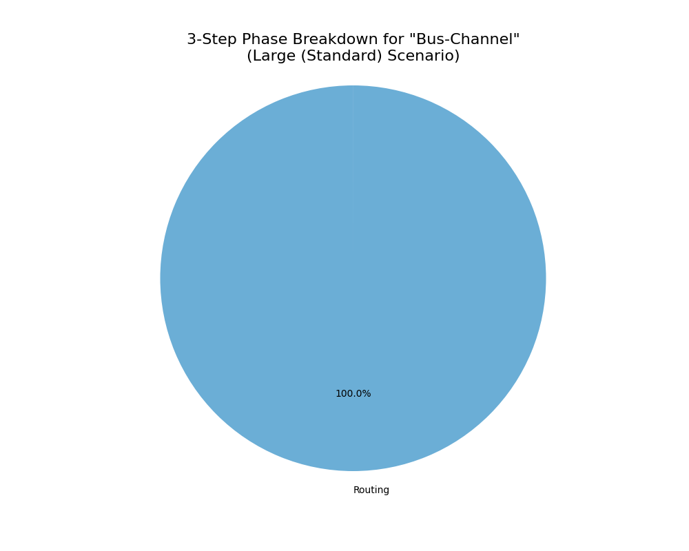

# Performance Benchmark Report

Date: 2025-10-10_10-25-28

## 📈 Overall Performance Summary

### Performance Visualization

|                                          |     mean |      std |      min |      max |
|:-----------------------------------------|---------:|---------:|---------:|---------:|
| ('Large (Standard)', 'A-Star')           |  1976.01 |   285.21 |  1736.47 |  2326.72 |
| ('Large (Standard)', 'Bus-Channel')      | 51236    | 18947.4  | 30454.5  | 72868.6  |
| ('Large (Standard)', 'Vertices-Network') | 23371.3  |  3639.31 | 18814    | 27815.3  |
| ('Medium', 'A-Star')                     |   678.15 |   148.98 |   506.77 |   909.78 |
| ('Medium', 'Bus-Channel')                | 25492.1  |  7459.05 | 18394    | 36232.1  |
| ('Medium', 'Vertices-Network')           |  5359.49 |  1325.26 |  3782.38 |  6831.81 |
| ('Small', 'A-Star')                      |    23.36 |     8.88 |    14.35 |    37.68 |
| ('Small', 'Bus-Channel')                 |   452.18 |   129.88 |   302.2  |   560.44 |
| ('Small', 'Vertices-Network')            |    66.24 |    24.69 |    36.43 |   104.74 |

 #### Analysis
[여기에 분석 내용을 직접 작성하세요]

 

 

## 🛠️ Performance for 'Large (Standard)' Scenario (average time in ms)

### Strategy: A-Star

#### three step result 

|              |   Average Time (ms) |
|:-------------|--------------------:|
| Placement    |                1.45 |
| Routing      |             1973.63 |
| Post-Process |                0.46 |

 

#### routing breakdown result

|            |   Average Time (ms) |
|:-----------|--------------------:|
| buildGrid  |                1.45 |
| aStar_Loop |             1971.92 |

 #### Analysis
[여기에 분석 내용을 직접 작성하세요]

 

 

### Strategy: Bus-Channel

#### three step result 

|              |   Average Time (ms) |
|:-------------|--------------------:|
| Placement    |                1.54 |
| Routing      |            51233    |
| Post-Process |                0.8  |

 

#### routing breakdown result

|                      |   Average Time (ms) |
|:---------------------|--------------------:|
| createBusChannels    |                3    |
| buildBusNetworkGraph |                0.04 |
| findRampCandidates   |                6.4  |
| findBestRamp         |            51063    |
| findBestOffRamp      |              156.98 |
| findBusRoute         |                0.53 |
| stitchPath           |                1.11 |
| Routing Fallback     |                0.37 |

 #### Analysis
[여기에 분석 내용을 직접 작성하세요]

 

 

### Strategy: Vertices-Network

#### three step result 

|              |   Average Time (ms) |
|:-------------|--------------------:|
| Placement    |                1.58 |
| Routing      |            23359.1  |
| Post-Process |                9.83 |

 

#### routing breakdown result

|                       |   Average Time (ms) |
|:----------------------|--------------------:|
| stitchPath            |                1.35 |
| createRoutingVertices |               35.68 |
| buildVisibilityGraph  |             5161.09 |
| findRampInfo          |            17385.2  |
| findPathOnGraph       |              772.12 |

 #### Analysis
[여기에 분석 내용을 직접 작성하세요]

 

 

