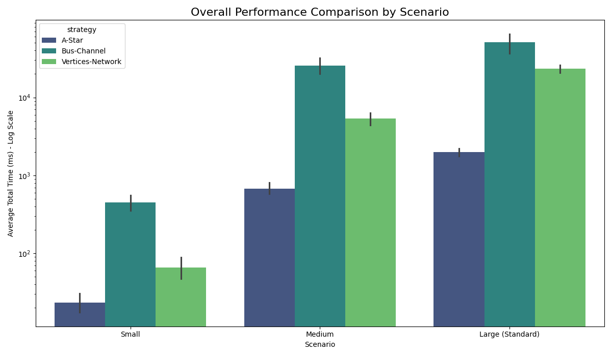
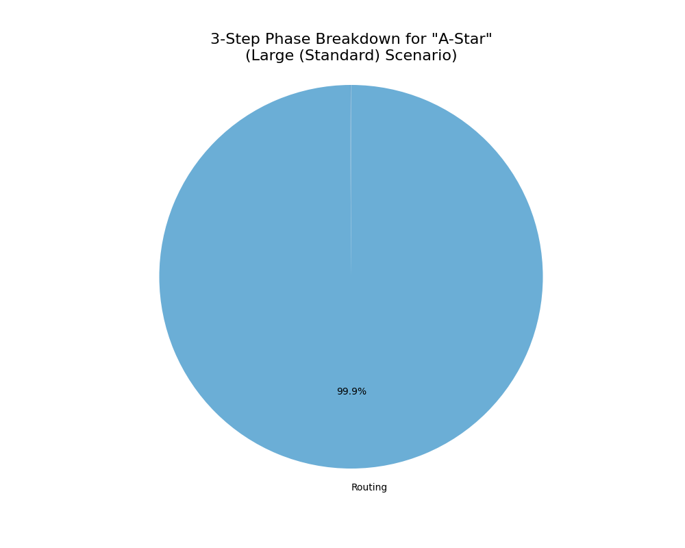

# Performance Benchmark Report

Date: 2025-10-10_10-25-28

## 📈 1. Summary

[측정에 대한 설명]

### 1.1. Performance Visualization

그림 1.1. Overall Performance Comparison
 

|  | mean | std | min | max |
| --- | ---: | ---: | ---: | ---: |
| ('Large (Standard)', 'A-Star') | 1976.01 | 285.21 | 1736.47 | 2326.72 |
| ('Large (Standard)', 'Bus-Channel') | 51235.96 | 18947.37 | 30454.46 | 72868.63 |
| ('Large (Standard)', 'Vertices-Network') | 23371.26 | 3639.31 | 18814.00 | 27815.32 |
| ('Medium', 'A-Star') | 678.15 | 148.98 | 506.77 | 909.78 |
| ('Medium', 'Bus-Channel') | 25492.06 | 7459.05 | 18394.04 | 36232.07 |
| ('Medium', 'Vertices-Network') | 5359.49 | 1325.26 | 3782.38 | 6831.81 |
| ('Small', 'A-Star') | 23.36 | 8.88 | 14.35 | 37.68 |
| ('Small', 'Bus-Channel') | 452.18 | 129.88 | 302.20 | 560.44 |
| ('Small', 'Vertices-Network') | 66.24 | 24.69 | 36.43 | 104.74 |

 #### 1.2. Analysis
[여기에 분석 내용을 직접 작성하세요]

 

 

## 🛠️ 1. Performance for 'Large (Standard)' Scenario (average time in ms)

### 1.1. Strategy: A-Star

#### 1.1.1. three step result 

<table>
  <tr>
    <td align="center">
    

     
    그림 1.1.1. three-Step Phase Breakdown for "A-Star"
    
  </td>
  <td align="center" width="50%">

|  | Average Time (ms) |
| --- | ---: |
| Placement | 1.45 |
| Routing | 1973.63 |
| Post-Process | 0.46 |

표 1.1.1. three-Step Phase Breakdown for "A-Star" 

  </td>
  </tr>
</table>
 

#### 1.1.2. routing breakdown result

<table>
  <tr>
    <td align="center">
    
  
     
    그림 1.1.2. Routing Phase Breakdown for "A-Star"
    
  </td>
  <td align="center" width="50%">

|  | Average Time (ms) |
| --- | ---: |
| buildGrid | 1.45 |
| aStar_Loop | 1971.92 |

표 1.1.2. Routing Phase Breakdown for "A-Star" 

  </td>
  </tr>
</table>
 

 #### 1.1.3. Analysis
[여기에 분석 내용을 직접 작성하세요]

 

### 1.2. Strategy: Bus-Channel

#### 1.2.1. three step result 

<table>
  <tr>
    <td align="center">
    

     
    그림 1.2.1. three-Step Phase Breakdown for "Bus-Channel"
    
  </td>
  <td align="center" width="50%">

|  | Average Time (ms) |
| --- | ---: |
| Placement | 1.54 |
| Routing | 51232.98 |
| Post-Process | 0.80 |

표 1.2.1. three-Step Phase Breakdown for "Bus-Channel" 

  </td>
  </tr>
</table>
 

#### 1.2.2. routing breakdown result

<table>
  <tr>
    <td align="center">
    
  
     
    그림 1.2.2. Routing Phase Breakdown for "Bus-Channel"
    
  </td>
  <td align="center" width="50%">

|  | Average Time (ms) |
| --- | ---: |
| createBusChannels | 3.00 |
| buildBusNetworkGraph | 0.04 |
| findRampCandidates | 6.40 |
| findBestRamp | 51063.01 |
| findBestOffRamp | 156.98 |
| findBusRoute | 0.53 |
| stitchPath | 1.11 |
| Routing Fallback | 0.37 |

표 1.2.2. Routing Phase Breakdown for "Bus-Channel" 

  </td>
  </tr>
</table>
 

 #### 1.2.3. Analysis
[여기에 분석 내용을 직접 작성하세요]

 

### 1.3. Strategy: Vertices-Network

#### 1.3.1. three step result 

<table>
  <tr>
    <td align="center">
    

     
    그림 1.3.1. three-Step Phase Breakdown for "Vertices-Network"
    
  </td>
  <td align="center" width="50%">

|  | Average Time (ms) |
| --- | ---: |
| Placement | 1.58 |
| Routing | 23359.11 |
| Post-Process | 9.83 |

표 1.3.1. three-Step Phase Breakdown for "Vertices-Network" 

  </td>
  </tr>
</table>
 

#### 1.3.2. routing breakdown result

<table>
  <tr>
    <td align="center">
    
  
     
    그림 1.3.2. Routing Phase Breakdown for "Vertices-Network"
    
  </td>
  <td align="center" width="50%">

|  | Average Time (ms) |
| --- | ---: |
| stitchPath | 1.35 |
| createRoutingVertices | 35.68 |
| buildVisibilityGraph | 5161.09 |
| findRampInfo | 17385.19 |
| findPathOnGraph | 772.12 |

표 1.3.2. Routing Phase Breakdown for "Vertices-Network" 

  </td>
  </tr>
</table>
 

 #### 1.3.3. Analysis
[여기에 분석 내용을 직접 작성하세요]

 

