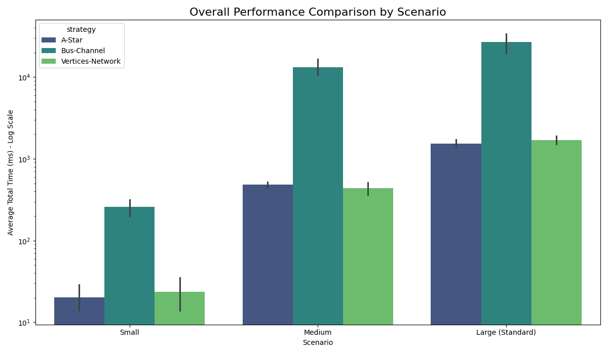
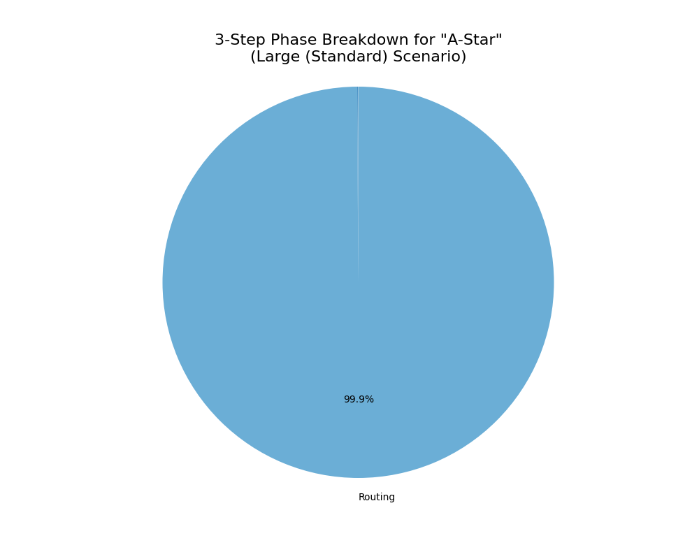
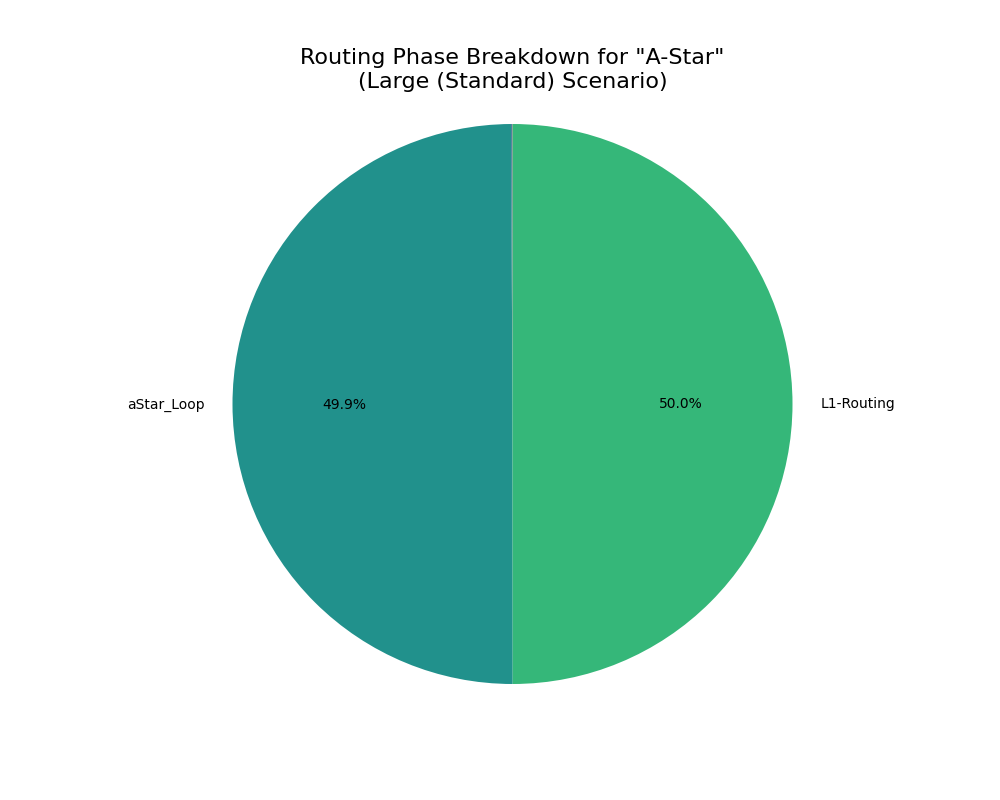
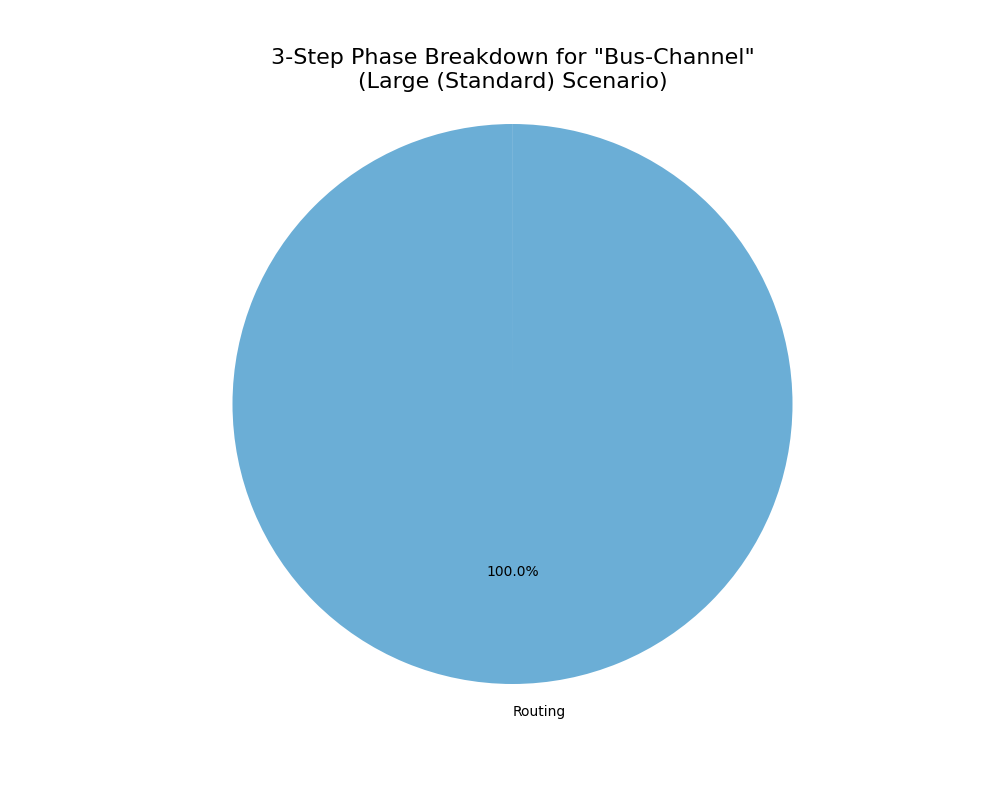
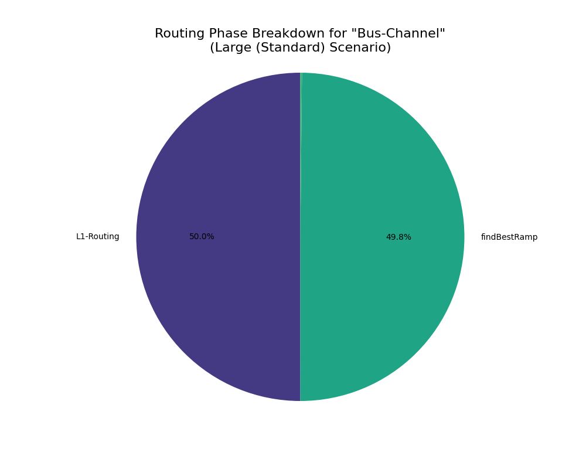
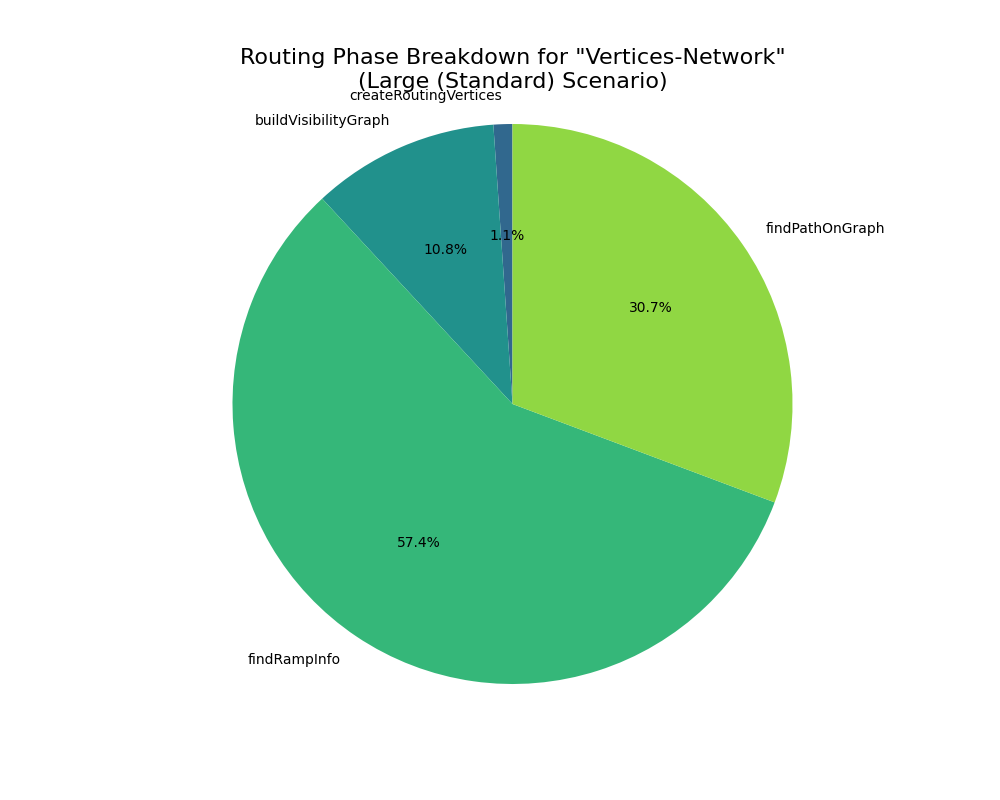

# Performance Benchmark Report

Date: 2025-10-13_17-57-14

## 📈 1. Summary

[측정에 대한 설명]

### 1.1. Performance Visualization

그림 1.1. Overall Performance Comparison

|                                          |     mean |     std |      min |      max |
|------------------------------------------|----------|---------|----------|----------|
|           ('Large (Standard)', 'A-Star') |  1539.70 |  209.49 |  1360.92 |  1826.11 |
|      ('Large (Standard)', 'Bus-Channel') | 26854.66 | 9566.82 | 16299.76 | 37092.93 |
| ('Large (Standard)', 'Vertices-Network') |  1698.50 |  263.60 |  1325.80 |  2001.93 |
|                     ('Medium', 'A-Star') |   482.71 |   46.31 |   412.80 |   535.56 |
|                ('Medium', 'Bus-Channel') | 13224.75 | 3844.78 |  9743.31 | 19152.33 |
|           ('Medium', 'Vertices-Network') |   436.71 |   94.69 |   335.08 |   553.43 |
|                      ('Small', 'A-Star') |    20.25 |    9.69 |    11.03 |    36.61 |
|                 ('Small', 'Bus-Channel') |   257.59 |   78.77 |   168.92 |   319.96 |
|            ('Small', 'Vertices-Network') |    23.54 |   13.76 |     9.65 |    44.66 |

 #### Analysis
[여기에 분석 내용을 직접 작성하세요]

 

 

## 1. 🛠️ Performance for 'Large (Standard)' Scenario (average time in ms)

### 1.1. Strategy: A-Star

#### 1.1.1. three step result 

<table>
  <tr>
    <td align="center">
    
     
    그림 1.1.1. 3-Step Phase Breakdown for "A-Star"
  </td>
  <td align="center" width="50%">

|              |   Average Time (ms) |
|--------------|---------------------|
|    Placement |                1.22 |
|      Routing |             1537.65 |
| Post-Process |                0.38 |

표 1.1.1. 3-Step Phase Breakdown for "A-Star" 

  </td>
  </tr>
</table>
 

#### 1.1.2. routing breakdown result

<table>
  <tr>
    <td align="center">
    
     
    그림 1.1.2. Routing Phase Breakdown for "A-Star"
  </td>
  <td align="center" width="50%">

|            |   Average Time (ms) |
|------------|---------------------|
|  buildGrid |                1.44 |
| aStar_Loop |             1536.05 |

표 1.1.2. Routing Phase Breakdown for "A-Star" 

  </td>
  </tr>
</table>
 

 #### Analysis
[여기에 분석 내용을 직접 작성하세요]

 

### 1.2. Strategy: Bus-Channel

#### 1.2.1. three step result 

<table>
  <tr>
    <td align="center">
    
     
    그림 1.2.1. 3-Step Phase Breakdown for "Bus-Channel"
  </td>
  <td align="center" width="50%">

|              |   Average Time (ms) |
|--------------|---------------------|
|    Placement |                1.26 |
|      Routing |            26852.49 |
| Post-Process |                0.46 |

표 1.2.1. 3-Step Phase Breakdown for "Bus-Channel" 

  </td>
  </tr>
</table>
 

#### 1.2.2. routing breakdown result

<table>
  <tr>
    <td align="center">
    
     
    그림 1.2.2. Routing Phase Breakdown for "Bus-Channel"
  </td>
  <td align="center" width="50%">

|                      |   Average Time (ms) |
|----------------------|---------------------|
|    createBusChannels |                1.27 |
| buildBusNetworkGraph |                0.05 |
|   findRampCandidates |                2.05 |
|         findBestRamp |            26762.05 |
|      findBestOffRamp |               84.09 |
|         findBusRoute |                0.49 |
|           stitchPath |                1.56 |
|     Routing Fallback |                0.02 |

표 1.2.2. Routing Phase Breakdown for "Bus-Channel" 

  </td>
  </tr>
</table>
 

 #### Analysis
[여기에 분석 내용을 직접 작성하세요]

 

### 1.3. Strategy: Vertices-Network

#### 1.3.1. routing breakdown result

<table>
  <tr>
    <td align="center">
    
     
    그림 1.3.1. Routing Phase Breakdown for "Vertices-Network"
  </td>
  <td align="center" width="50%">

|                       |   Average Time (ms) |
|-----------------------|---------------------|
|            stitchPath |                0.27 |
|             Placement |                1.06 |
| createRoutingVertices |               18.12 |
|  buildVisibilityGraph |              182.36 |
|          findRampInfo |              968.46 |
|       findPathOnGraph |              518.33 |
|               Routing |             1690.36 |
|          Post-Process |                6.51 |

표 1.3.1. Routing Phase Breakdown for "Vertices-Network" 

  </td>
  </tr>
</table>
 

 #### Analysis
[여기에 분석 내용을 직접 작성하세요]

 

