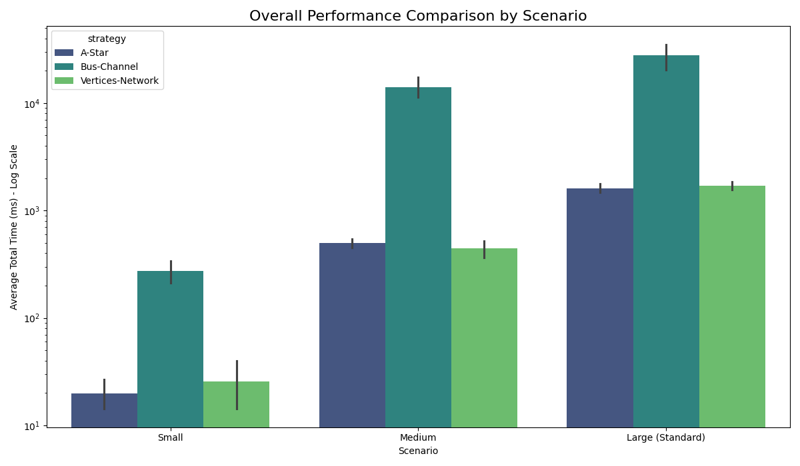
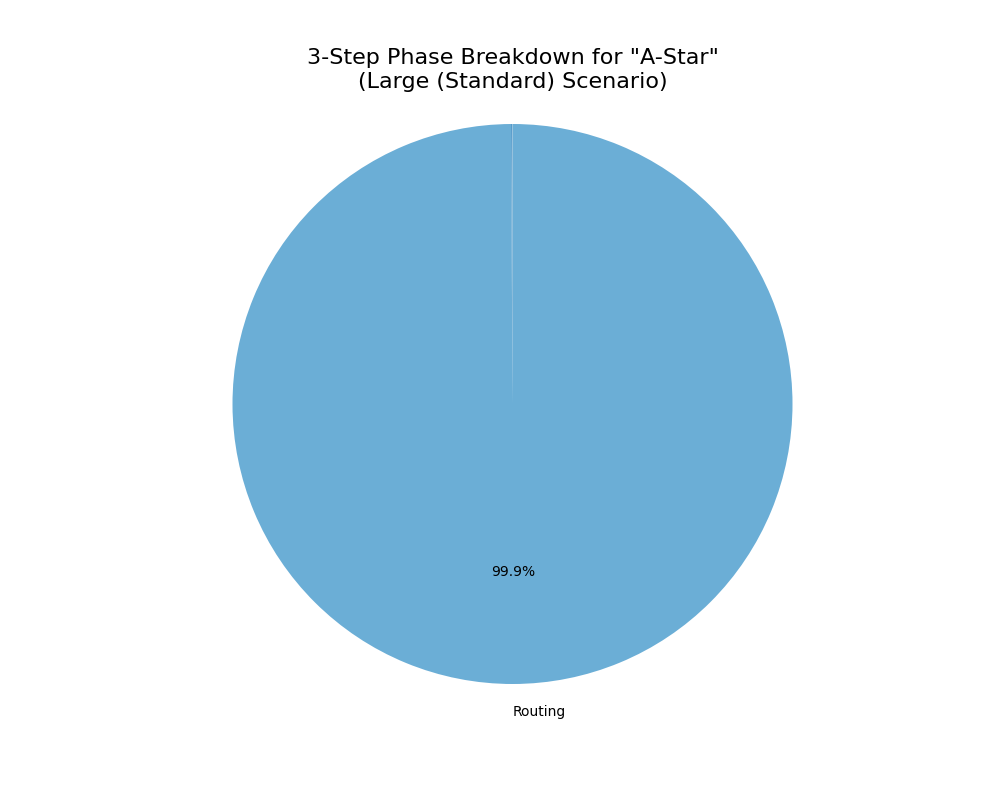
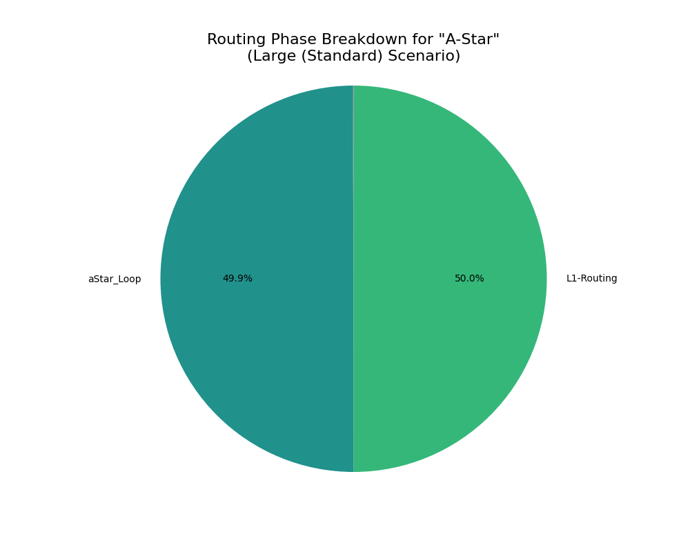
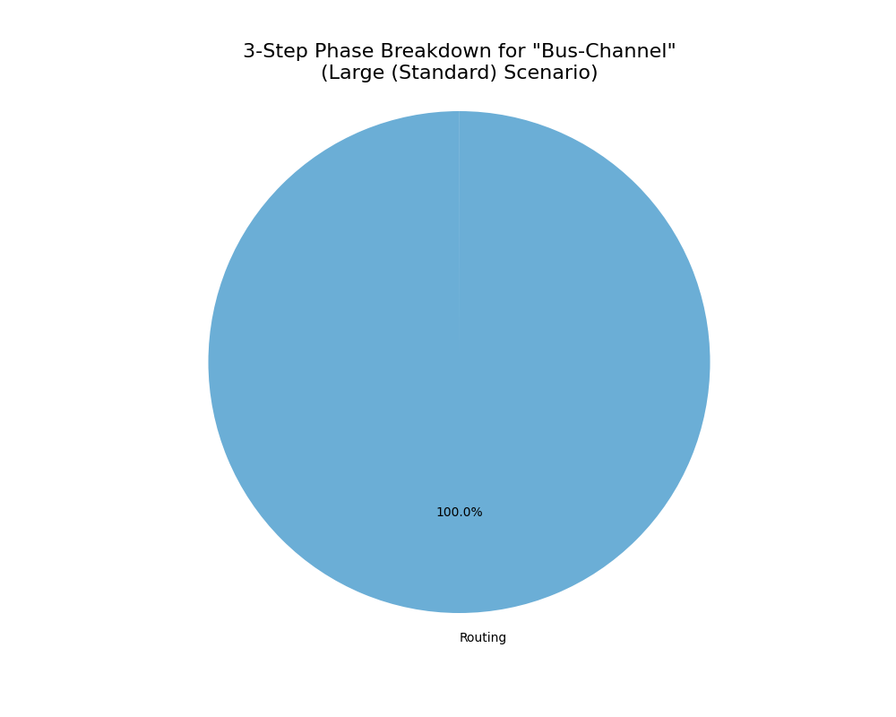
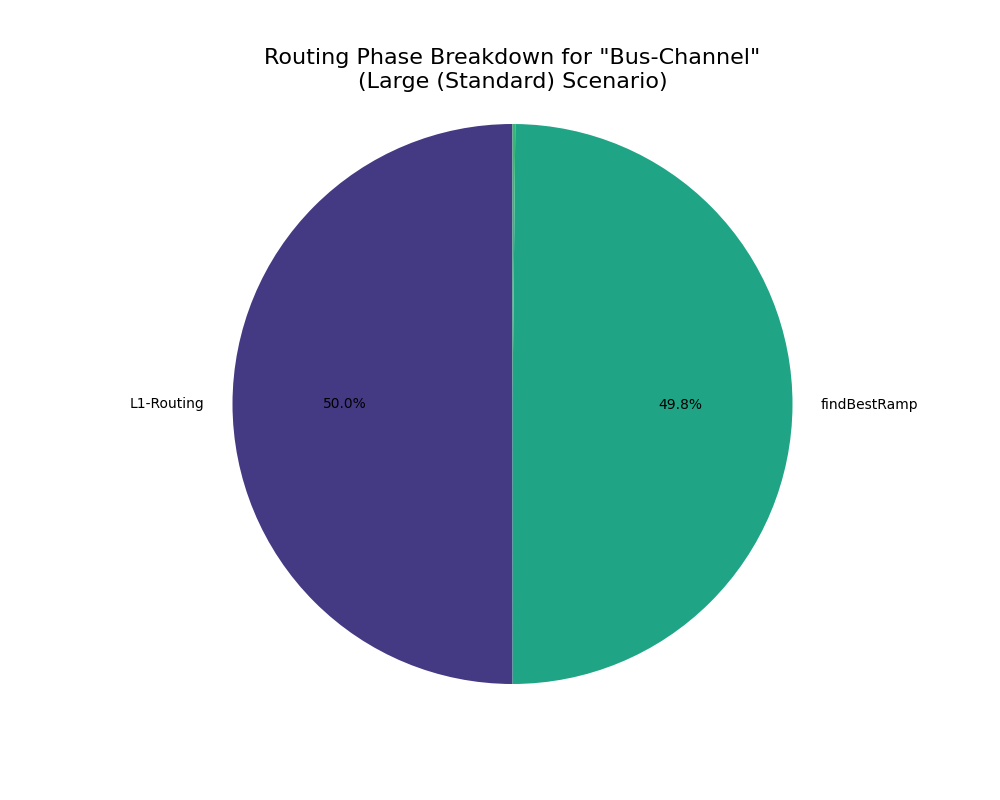
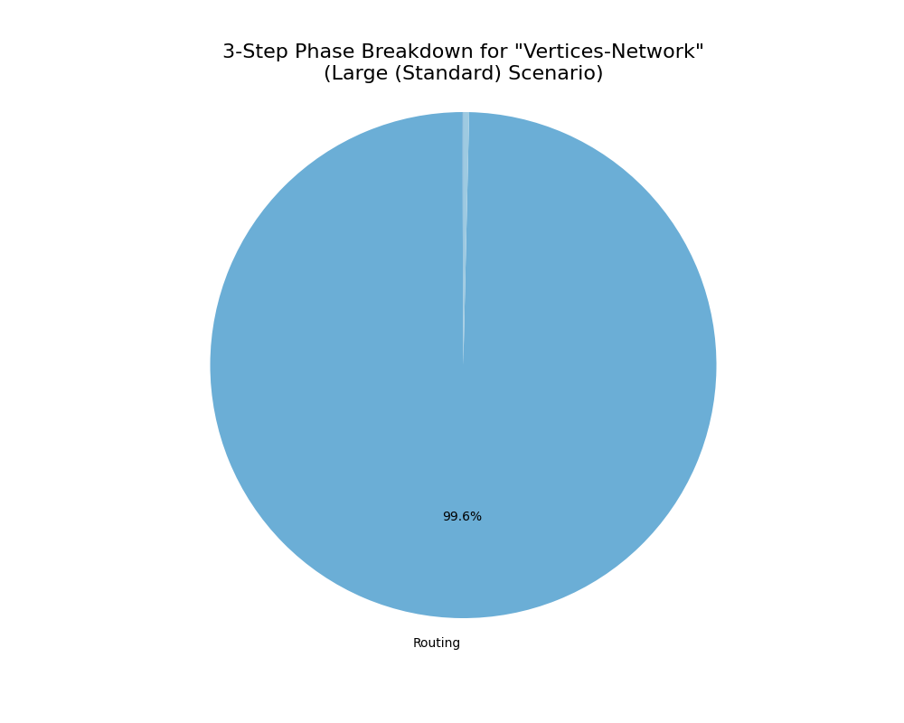
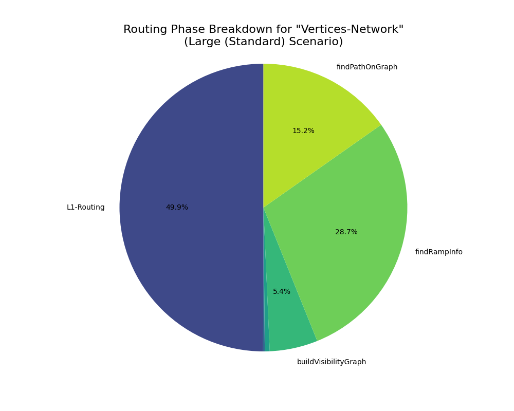

# Performance Benchmark Report

Date: 2025-10-14_14-12-57

## 📈 1. Summary

[측정에 대한 설명]

### 1.1. Performance Visualization

그림 1.1. Overall Performance Comparison
 

|  | mean | std | min | max |
| --- | ---: | ---: | ---: | ---: |
| ('Large (Standard)', 'A-Star') | 1597.88 | 201.07 | 1412.33 | 1905.96 |
| ('Large (Standard)', 'Bus-Channel') | 27790.27 | 9524.81 | 17359.39 | 38446.85 |
| ('Large (Standard)', 'Vertices-Network') | 1704.19 | 200.55 | 1436.91 | 1960.65 |
| ('Medium', 'A-Star') | 496.17 | 60.47 | 402.82 | 564.92 |
| ('Medium', 'Bus-Channel') | 14071.44 | 3813.23 | 10304.42 | 19824.18 |
| ('Medium', 'Vertices-Network') | 441.30 | 103.82 | 331.40 | 564.39 |
| ('Small', 'A-Star') | 19.83 | 8.66 | 11.01 | 34.00 |
| ('Small', 'Bus-Channel') | 275.31 | 84.89 | 181.84 | 351.33 |
| ('Small', 'Vertices-Network') | 25.66 | 17.23 | 10.74 | 53.73 |

 #### 1.2. Analysis
[여기에 분석 내용을 직접 작성하세요]

 

 

## 🛠️ 1. Performance for 'Large (Standard)' Scenario (average time in ms)

### 1.1. Strategy: A-Star

#### 1.1.1. three step result 

<table>
  <tr>
    <td align="center">
    

     
    그림 1.1.1. three-Step Phase Breakdown for "A-Star"
    
  </td>
  <td align="center" width="50%">

|  | Average Time (ms) |
| --- | ---: |
| Placement | 1.21 |
| Routing | 1595.84 |
| Post-Process | 0.39 |

표 1.1.1. three-Step Phase Breakdown for "A-Star" 

  </td>
  </tr>
</table>
 

#### 1.1.2. routing breakdown result

<table>
  <tr>
    <td align="center">
    
  
     
    그림 1.1.2. Routing Phase Breakdown for "A-Star"
    
  </td>
  <td align="center" width="50%">

|  | Average Time (ms) |
| --- | ---: |
| buildGrid | 1.23 |
| aStar_Loop | 1594.44 |

표 1.1.2. Routing Phase Breakdown for "A-Star" 

  </td>
  </tr>
</table>
 

 #### 1.1.3. Analysis
[여기에 분석 내용을 직접 작성하세요]

 

### 1.2. Strategy: Bus-Channel

#### 1.2.1. three step result 

<table>
  <tr>
    <td align="center">
    

     
    그림 1.2.1. three-Step Phase Breakdown for "Bus-Channel"
    
  </td>
  <td align="center" width="50%">

|  | Average Time (ms) |
| --- | ---: |
| Placement | 1.48 |
| Routing | 27787.70 |
| Post-Process | 0.68 |

표 1.2.1. three-Step Phase Breakdown for "Bus-Channel" 

  </td>
  </tr>
</table>
 

#### 1.2.2. routing breakdown result

<table>
  <tr>
    <td align="center">
    
  
     
    그림 1.2.2. Routing Phase Breakdown for "Bus-Channel"
    
  </td>
  <td align="center" width="50%">

|  | Average Time (ms) |
| --- | ---: |
| createBusChannels | 1.25 |
| buildBusNetworkGraph | 0.06 |
| findRampCandidates | 2.03 |
| findBestRamp | 27694.62 |
| findBestOffRamp | 86.66 |
| findBusRoute | 0.51 |
| stitchPath | 1.62 |
| Routing Fallback | 0.02 |

표 1.2.2. Routing Phase Breakdown for "Bus-Channel" 

  </td>
  </tr>
</table>
 

 #### 1.2.3. Analysis
[여기에 분석 내용을 직접 작성하세요]

 

### 1.3. Strategy: Vertices-Network

#### 1.3.1. three step result 

<table>
  <tr>
    <td align="center">
    

     
    그림 1.3.1. three-Step Phase Breakdown for "Vertices-Network"
    
  </td>
  <td align="center" width="50%">

|  | Average Time (ms) |
| --- | ---: |
| Placement | 1.04 |
| Routing | 1696.39 |
| Post-Process | 6.31 |

표 1.3.1. three-Step Phase Breakdown for "Vertices-Network" 

  </td>
  </tr>
</table>
 

#### 1.3.2. routing breakdown result

<table>
  <tr>
    <td align="center">
    
  
     
    그림 1.3.2. Routing Phase Breakdown for "Vertices-Network"
    
  </td>
  <td align="center" width="50%">

|  | Average Time (ms) |
| --- | ---: |
| stitchPath | 0.31 |
| createRoutingVertices | 18.40 |
| buildVisibilityGraph | 183.56 |
| findRampInfo | 973.67 |
| findPathOnGraph | 517.65 |

표 1.3.2. Routing Phase Breakdown for "Vertices-Network" 

  </td>
  </tr>
</table>
 

 #### 1.3.3. Analysis
[여기에 분석 내용을 직접 작성하세요]

 

