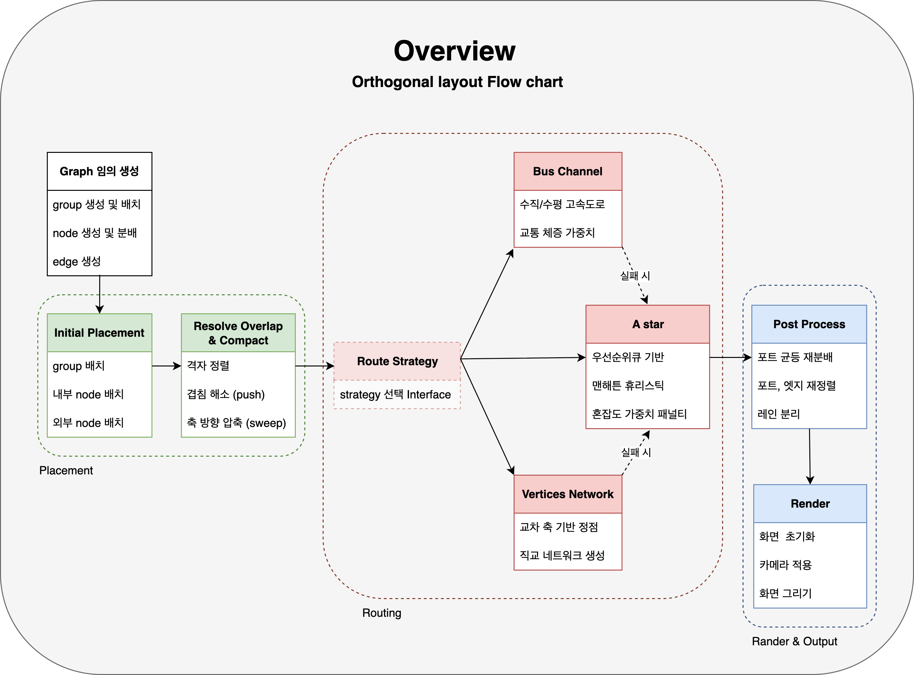

# 아키텍처 개요

Date: 2025-09-18  
Status: Accepted

## 맥락

 본 프로젝트는 [Kārlis Freivalds and Jans Glagoļevs, "Graph Compact Orthogonal Layout Algorithm" (2013) 논문](../src/arxiv_Orthogonal%20layout%20Algorithm.pdf) 을 참고하며 시작했습니다.  
논문은 **총 엣지 길이 최소화**를 핵심 목표로 하여, 교차·굴곡·면적을 간접적으로 줄이는 구조를 제안합니다.

하지만, 본 프로젝트에선 **제약식 기반 QP(Quadratic Programming)** 대신 **휴리스틱 기반 접근**으로 단순화했습니다.

즉, 본 프로젝트는 **논문에서 제안한 3단계 파이프라인(Node Placement → Edge Routing → Compaction)** 을 차용하되, 현실적 범위에서 단순화·대체한 전략을 사용했습니다.

## 결정

 논문과 프로젝트 적용 방식을 비교하면 다음과 같습니다:

| 구분                    | 논문 제안 방식                                                 | 프로젝트 적용 방식                                          |
| ----------------------- | -------------------------------------------------------------- | ----------------------------------------------------------- |
| **최적화 목표**         | 총 엣지 길이 최소화 (교차·굴곡·면적 간접 억제)                 | 동일하게 채택, 비용 함수에 거리·굴곡·혼잡도 패널티 반영     |
| **노드 배치**           | 격자(Grid) 기반 + 시뮬레이티드 어닐링 + 무작위 이동 + 스왑     | 단순 격자 초기화 + BFS/랜덤 배치 → Sweep & Push로 겹침 해소 |
| **전역 최적화(컴팩션)** | 가시성 그래프 기반 QP(Quadratic Programming)                   | 휴리스틱 압축(줄맞추기, 겹치면 밀기, 축 방향 압축)으로 대체 |
| **엣지 라우팅**         | IC 레이아웃 기법 차용, 직교 경로 탐색, 교차 최소화는 간접 효과 | A\* 베이스라인 → Bus Channel → Visibility Graph 순차 발전   |
| **초기 배치**           | Force-directed, BFS, Random 제안                               | Random + BFS 초기화 적용, Force-directed는 시간상 제외      |
| **매개변수**            | γ(간격 배수), 정렬 보정항(1/20) 등                             | 최소 간격, 반복 횟수, 가중치 등을 `config.ts`로 외부화      |

### 아키텍처 단계 설명

  

#### 1. Graph 생성 및 배치 (Placement)

- **Graph 생성**: 노드·엣지·그룹을 무작위로 배치 → 초기 상태는 겹침/혼잡 존재
- **Initial Placement**: 그룹 및 노드를 격자 기반 정렬 → 대략적 질서 부여
- **Resolve Overlap & Compact**: 겹침 밀어내기(push), 최소 간격 확보, 여백 압축(sweep)으로 배치 최적화

#### 2. 라우팅 전략 (Routing)

- **전략 패턴 적용**: 필요에 따라 라우팅 알고리즘 교체 가능
  - **A\***: 기본 전략. 그리드 + 우선순위 큐로 장애물 회피
  - **Bus Channel**: 빈 공간을 ‘고속도로 채널’로 활용 → 정돈성 향상
    > **TODO**: 성능 개선  
    > **TODO**: 그룹 밖 채널 겹침 문제  
    > **TODO**: 채널 넓이 확보 및 우회 필요
  - **Vertices Network**: 장애물 모서리를 정점으로 연결한 가시성 그래프 → 복잡 상황에서도 고품질 경로
    > **TODO**: 안전 지역 내 정점 생성 문제  
    > **TODO**: 단순 경로 최적화 필요
- **폴백(Fallback)**: Bus/Vertices 실패 시 A\*로 재탐색

#### 3. 후처리 및 렌더링 (Post Process & Render)

- **Post Process**:
  - 포트 균등 분배 (엣지 꼬임 방지)
  - 동일 경로는 레인 분리(차선처럼 병렬 배치)
- **Render**: HTML5 Canvas에 결과 출력, 카메라 줌/패닝 적용 → 최종 직교 레이아웃 시각화

## 결과

 ① **논문 차용의 성과**

- 이론적으로 검증된 “총 엣지 길이 최소화” 프레임워크를 기반으로 하여, 교차·굴곡·면적 모두 일정 수준에서 억제할 수 있었습니다.
- 3단계 파이프라인 구조는 실제 구현에서도 유효했으며, 전략적 확장(A\*, Bus, Vertices)에도 자연스럽게 연결되었습니다.

② **현실적 절충안**

- QP를 포기하고 휴리스틱 압축으로 대체하여, 구현 난이도를 낮추면서도 “콤팩트한 결과”를 얻을 수 있었습니다.
- 초기 배치와 반복 최적화 단계를 단순화하여, 120노드/180엣지 시나리오에서 1\~2초 내 결과를 확보했습니다.
  > bus-channel 방식 제외

③ **한계와 고려사항**

- 휴리스틱 기반 접근이므로 **전역 최적해 보장 없음**, 대규모 그래프에서는 파라미터 튜닝이 필요합니다.
- Force-directed 초기화나 QP 기반 컴팩션은 제외되었으므로, 상용 툴 수준의 정밀 최적화에는 미치지 못합니다.
