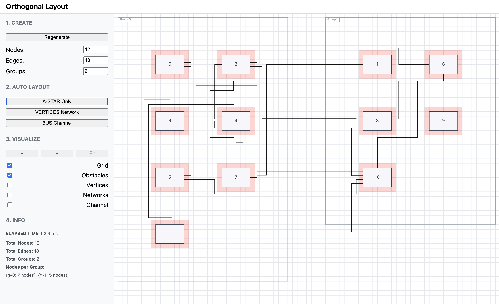
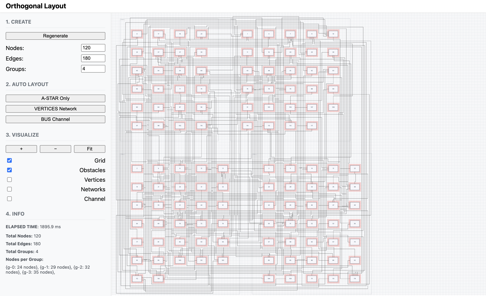

# A\* 기반 경로 탐색 베이스라인

Date: 2025-09-19  
Status: Accepted

## 맥락

 직교 라우팅의 첫 단계로, **기본 경로 탐색 알고리즘**이 필요했습니다.  
요구사항은 다음과 같았습니다:

① 모든 엣지는 수평/수직 선분으로만 구성되어야 함  
② 노드/그룹 장애물을 회피해야 함  
③ 굴곡 수와 교차 수를 최소화해야 함  
④ 엣지는 노드의 포트(상/하/좌/우)에서 출발/도착해야 함

이러한 조건을 효율적으로 만족시키기 위해, 직관적이고 휴리스틱 기반 확장이 가능한 **A\*** 알고리즘을 초기 베이스라인으로 선택했습니다.

## 결정

<table align="center">
  <tr>
    <td align="center">
      
       
      12노드 / 18엣지 / 2그룹 시나리오
    </td>
    <td align="center">
      
       
      60노드 / 90엣지 / 3그룹 시나리오
    </td>
    <td align="center">
      
       
      120노드 / 180엣지 / 4그룹 시나리오
    </td>
  </tr>
</table>

> 안전 영역 : 노드 주변 빨강 테두리

 ① **격자 기반 탐색 공간 정의**

- 다이어그램 영역을 일정한 크기의 그리드 셀로 분할
- 노드/그룹의 Bounding Box는 장애물로 등록

② **A\* 알고리즘 적용**

- 휴리스틱: 맨해튼 거리 사용
- 비용 함수: 이동 거리 + 굴곡 패널티 + 혼잡도 패널티
- 탐색 구조: 우선순위 큐 기반 Open Set
  > 초기 배열 기반 O(n)의 수행시간을 우선순위 큐 기반으로 O(logN)으로 개선

③ **포트 제약 반영**

- 시작/종료 지점을 노드 포트 위치로 지정
- 잘못된 초기 방향 선택 시 큰 패널티 부여

④ **성능 최적화**

- 탐색 불가능한 경우 조기 종료 처리
- 우선순위 큐로 성능 확보 (O(logN) 선택)

## 결과

| 항목          | 내용                                                                                 |
| ------------- | ------------------------------------------------------------------------------------ |
| **요구 충족** | 모든 엣지가 포트 간 직교 경로로 연결되고 장애물 회피 성공                            |
| **경로 품질** | 불필요한 굴곡 감소, 비교적 직선적 경로 확보                                          |
| **성능**      | 120노드/180엣지 그래프 기준 수백 ms 내 실행 완료                                     |
| **한계**      | 모든 엣지를 개별 탐색 → 엣지 수가 많아지면 성능 저하, 전체 교차 최소화에는 한계 존재 |
