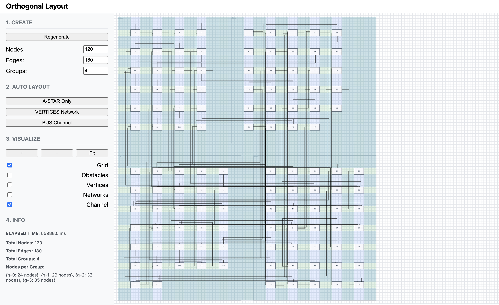

# 버스 채널 라우팅

Date: 2025-09-21  
Status: Accepted

## 맥락

 A\* 베이스라인 정확성은 보장하나, 엣지 수 증가 시 개별 격자 탐색 누적으로 **성능 저하**와 **경로 품질 편차**가 관찰되었습니다.  
여러 엣지가 유사한 방향으로 이동함에도 각자 탐색하여 **중복 경로**와 **불필요한 굴곡**이 발생했습니다.  
이를 완화하기 위해 도로망처럼 **공통 통로(채널)** 를 미리 구축하여 탐색 공간을 축소하는 전략을 채택합니다.

> 결과적으론 모든 성능 개선 시도는 실패했습니다.

## 결정

<table align="center">
  <tr>
    <td align="center">
      
       
      12노드 / 18엣지 / 2그룹 시나리오
    </td>
    <td align="center">
      
       
      60노드 / 90엣지 / 3그룹 시나리오
    </td>
    <td align="center">
      
       
      120노드 / 180엣지 / 4그룹 시나리오
    </td>
  </tr>
</table>

> 수평 이동 채널 :배경의 파랑 부분  
> 수직 이동 채널 : 배경의 초록 부분

 ① **채널 생성**

- 노드/그룹 경계 사이의 빈 공간을 스캔하여 수평/수직 **BusChannel**을 생성
- 채널 간격·두께는 config로 관리, 장애물과 안전 여백 유지

② **채널 네트워크 그래프화**

- 채널 교차 지점을 노드로, 구간을 간선으로 하여 **ChannelGraph** 구성
- 단절 구간은 그래프에서 분리하여 탐색 시 제외

③ **On/Off Ramp 라우팅**

- 각 엣지는 가장 가까운 채널로 **진입(On-Ramp)** → 채널 그래프 경로 이동 → 목적지 인접 채널에서 **진출(Off-Ramp)**
- 그래프 상 최단 경로 탐색(BFS/간단 가중치) 적용

④ **폴백(Fallback) A**\*

- 채널만으로 연결 불가한 엣지는 **개별 A**\*로 재탐색 후 병합
- 라우팅 실패 제로를 목표로 안전망 확보

⑤ **사후 정리(Post-Process)**

- 포트 정렬 및 단순화(연속 직선 병합)
- 디버그를 위해 채널 기반/폴백 경로를 구분 표시

## 결과

 

| 항목          | 내용                                                                                                                                                                                      |
| ------------- | ----------------------------------------------------------------------------------------------------------------------------------------------------------------------------------------- |
| **성능**      | 채널 그래프에서 탐색하므로 탐색 공간 축소   **하지만 채널 생성 비용이 예상보다 커 성능 향상으로 이어지지 않음**                                                                       |
| **교차 감소** | 공통 통로 유도로 **경로 교차·중복 감소**, 가독성 개선                                                                                                                                     |
| **안정성**    | 채널 미연결 케이스는 A\* 폴백으로 **실패 방지**                                                                                                                                           |
| **한계**      | **채널 생성에 예상보다 큰 비용이 소요되어 시간 효율성이 떨어짐**,   동일 채널 과밀 시 **경로 중첩** 가능,   채널이 노드를 덮어서 경로가 노드 내부를 통과하는 문제,   채널 격자 탓에 **불필요 굴곡** 잔존 → 다음 단계(정점 네트워크)로 보완 |

> 성능 개선 및 교차 과밀 해소 시 가장 시각적으로 깔끔한 경로 제공
