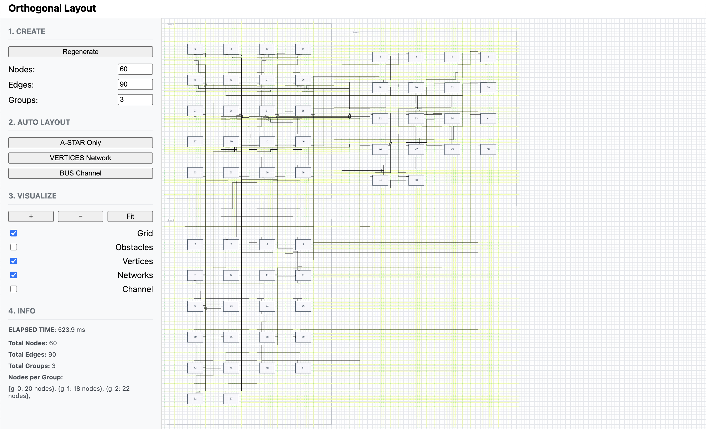
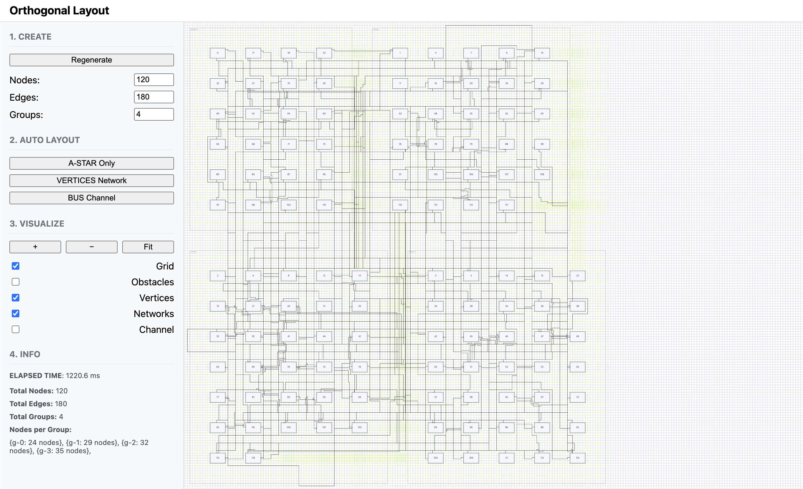

# 정점 네트워크 라우팅

Date: 2025-09-22  
Status: Accepted

## 맥락

 버스 채널 라우팅에선 노드가 늘어날수록 기하급수적인 성능 감소가 발생했습니다.
뿐만 아니라 채널 과밀로 인한 **경로 품질**에 한계가 있었습니다.

- 채널 격자 제약으로 불필요한 굴곡 발생
- 동일 채널 사용 시 엣지들이 겹쳐 구분 어려움

이를 보완하기 위해 장애물의 모서리와 포트 주변에 **정점(Vertex)**을 생성하고, 가시성이 확보된 정점들을 연결하는 **가시성 그래프(Visibility Graph)**를 활용하는 방식을 도입했습니다.

> 결과적으론 아직 개선할 부분이 많이 있습니다.

## 결정

<table align="center">
  <tr>
    <td align="center">
      
       
      12노드 / 18엣지 / 2그룹 시나리오
    </td>
    <td align="center">
      
       
      60노드 / 90엣지 / 3그룹 시나리오
    </td>
    <td align="center">
      
       
      120노드 / 180엣지 / 4그룹 시나리오
    </td>
  </tr>
</table>

> 정점 : 배경의 초록점  
> 네트워크 : 배경의 노란선

 ① **라우팅 정점 생성**

- 노드/그룹의 모서리, 포트 주변, 빈 공간의 축 교차점에 정점을 추가
- 장애물과의 최소 간격 확보 후 배치

② **가시성 그래프 구축**

- 정점 간 장애물에 가로막히지 않는 경우 간선으로 연결
- 수평/수직 방향을 우선 고려해 직교 형태 유지

③ **\*_A_ 탐색 적용**

- 가시성 그래프 상에서 출발/도착 정점을 연결하는 최단 경로 탐색
- 휴리스틱: 맨해튼 거리
- 혼잡도 비용을 추가하여 특정 경로에 엣지가 몰리지 않도록 조정 **[개선 필요]**

④ **포트 기반 최적화**

- 출발·도착 노드의 상대 위치를 분석해 최적 포트 면을 선택
- 불필요한 초기 굴곡 방지 **[개선 필요]**

⑤ **후처리**

- 동일 경로 공유 시 레인 분리(병렬 이동) **[개선 필요]**
- 일직선상 정점은 병합해 경로 단순화 (요구사항에 따라 변동)

## 결과

| 항목          | 내용                                                                                                                                        |
| ------------- | ------------------------------------------------------------------------------------------------------------------------------------------- |
| **경로 품질** | 불필요한 굴곡 감소, 직관적이고 깔끔한 경로 확보, Bus Channel 방식의 성능 한계 극복                                                          |
| **교차 감소** | 동일 선분 공유 시 레인 분리로 중첩 해소 **[개선 필요]**                                                                                     |
| **성능**      | 정점/간선 수가 제한적이어서 성능은 양호 (채널 기반과 유사)                                                                                  |
| **제약 준수** | 포트 방향 제약을 충족하며 부드러운 연결 달성                                                                                                |
| **한계**      | 긴단한 'ㅡ' 및 'ㄴ' 경로 최적화 필요,   aStar 안전 지역 내 정점 생성 문제 해결 필요   동적으로 정점 추가 생성을 통한 과밀 해소 필요 |
